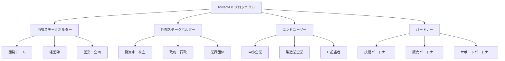
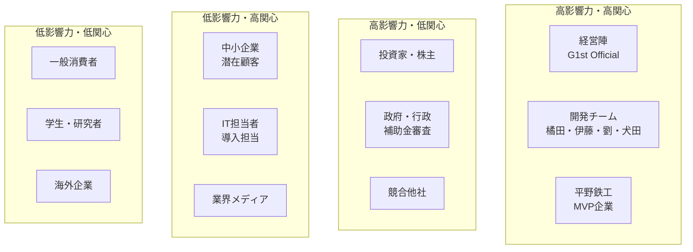
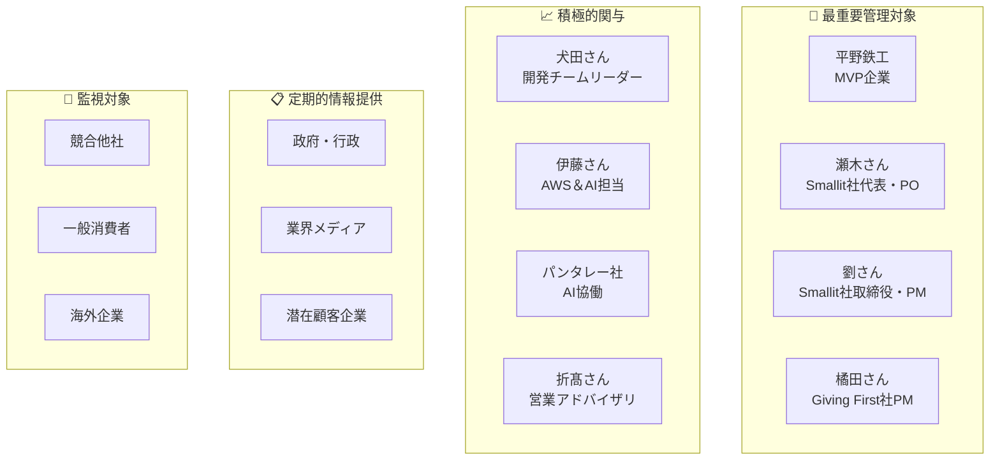

# 🗺️ Torrent4.0 ステークホルダーマップ
*2025年1月15日 最新版*

---

## 📊 ステークホルダー全体像

---

## 🎯 ステークホルダー分析マトリックス

### 📈 影響力 × 関心度マトリックス

---

## 👥 内部ステークホルダー

### 🏢 経営・戦略層

| ステークホルダー | 役割 | 期待値 | コミュニケーション頻度 |
|------------------|------|--------|----------------------|
| **瀬木さん** | Smallit社代表取締役・プロジェクトオーナー | 事業成功・ROI | 週次 |
| **劉さん** | Smallit社取締役・開発チームPM | 開発成功・品質 | 日次 |

### 💻 開発・技術層

| ステークホルダー | 役割 | 期待値 | コミュニケーション頻度 |
|------------------|------|--------|----------------------|
| **犬田さん** | Smallit社開発チームリーダー | 技術品質・進捗 | 日次 |
| **伊藤さん** | AWS＆AI担当開発エンジニア（2025/10/07参画） | 技術革新・AI実装 | 日次 |

### 🤝 外部パートナー・協力者

| ステークホルダー | 役割 | 期待値 | コミュニケーション頻度 |
|------------------|------|--------|----------------------|
| **橘田さん** | Giving First社・プロジェクトマネージャー | プロジェクト成功 | 日次 |
| **折髙さん** | Giving First社・営業アドバイザリ | 営業戦略・顧客獲得 | 週次 |
| **田中さん** | パンタレー社・AI活用担当 | AI技術協力 | 週次 |
| **岩野さん** | パンタレー社・AWS＆AI担当 | AI技術協力・インフラ | 週次 |
| **rikiさん** | パンタレー社・AI活用担当 | AI技術協力 | 週次 |

---

## 🤝 外部パートナー

### 🔧 技術パートナー

| パートナー | 役割 | 期待値 | 関係性 |
|------------|------|--------|--------|
| **パンタレー社** | AI機能協働開発 | 技術協力・収益 | 戦略的パートナー |
| **AWS** | クラウドインフラ提供 | 安定性・コスト | ベンダー |
| **セキュリティ会社** | セキュリティ監査 | 安全性確保 | 専門業者 |

### 🏢 販売・サポートパートナー

| パートナー | 役割 | 期待値 | 関係性 |
|------------|------|--------|--------|
| **Giving First社** | プロジェクトマネジメント・営業支援 | プロジェクト成功 | 戦略的パートナー |
| **システム integrator** | 導入支援 | 販売機会 | 販売パートナー |
| **コンサルティング会社** | 業務改善支援 | 付加価値提供 | 協業パートナー |

---

## 🏭 エンドユーザー

### 🎯 主要顧客セグメント

#### 🏢 中小製造業企業

| 企業 | 規模 | 現状 | ニーズ | 優先度 |
|------|------|------|--------|--------|
| **平野鉄工** | 年商2億円 | アナログ中心 | 全体デジタル化 | 最優先 |
| **B社** | 年商数十億円 | 一部システム化 | 部分導入 | 高優先 |
| **C社** | 年商百何十億円 | PDCA課題 | CAサイクル改善 | 中優先 |
| **D社** | トヨタ系 | システム化済み | 段階的拡大 | 中優先 |

#### 👤 ユーザーペルソナ

| ペルソナ | 役職 | 期待値 | コミュニケーション方法 |
|----------|------|--------|----------------------|
| **田中健一** | 営業部長 | 営業効率化 | ヒアリング・デモ |
| **山田太郎** | 社長 | 経営改善 | 経営層向け説明 |
| **佐藤美咲** | 現場作業員 | 作業効率化 | ユーザビリティテスト |
| **鈴木一郎** | IT担当者 | システム連携 | 技術説明・研修 |

---

## 🏛️ 外部環境ステークホルダー

### 💰 投資・資金調達

| ステークホルダー | 役割 | 期待値 | コミュニケーション頻度 |
|------------------|------|--------|----------------------|
| **投資家** | 資金提供・事業支援 | ROI・成長性 | 四半期 |
| **銀行・金融機関** | 融資・資金調達 | 返済能力 | 年次 |
| **補助金審査機関** | 補助金採択 | 事業計画・実績 | 申請時 |

### 🏛️ 政府・行政

| ステークホルダー | 役割 | 期待値 | コミュニケーション頻度 |
|------------------|------|--------|----------------------|
| **経済産業省** | DX推進政策 | 政策適合性 | 年次 |
| **中小企業庁** | 中小企業支援 | 中小企業支援 | 年次 |
| **地方自治体** | 地域経済振興 | 地域貢献 | 必要時 |

### 📰 業界・メディア

| ステークホルダー | 役割 | 期待値 | コミュニケーション頻度 |
|------------------|------|--------|----------------------|
| **業界メディア** | 情報発信・認知向上 | 話題性・新規性 | 必要時 |
| **ITメディア** | 技術情報発信 | 技術革新性 | 必要時 |
| **業界団体** | 業界標準・ネットワーク | 業界貢献 | 年次 |

---

## 🎯 ステークホルダー管理戦略

### 📊 優先度分類

### 🗣️ コミュニケーション戦略

#### 🎯 最重要ステークホルダー
- **頻度**: 日次〜週次
- **方法**: 直接対話、Slack、定期会議
- **内容**: 進捗報告、課題共有、意思決定

#### 📈 高優先ステークホルダー
- **頻度**: 週次〜月次
- **方法**: 定期報告、デモ、ヒアリング
- **内容**: 成果報告、フィードバック収集

#### 📋 中優先ステークホルダー
- **頻度**: 月次〜四半期
- **方法**: ニュースレター、イベント、資料配布
- **内容**: プロジェクト概要、成果発表

#### 👀 低優先ステークホルダー
- **頻度**: 必要時
- **方法**: プレスリリース、Webサイト
- **内容**: 重要なマイルストーン、成果発表

---

## 📅 ステークホルダー管理スケジュール

### 🗓️ 月次管理計画

| 月 | 重点ステークホルダー | 主要活動 | 成果物 |
|----|---------------------|----------|--------|
| **1月** | 平野鉄工、開発チーム | ヒアリング実施、スプリント開始 | ヒアリング結果、開発計画 |
| **2月** | パンタレー社、経営陣 | AI機能設計、予算承認 | 技術仕様書、予算計画 |
| **3月** | 潜在顧客、投資家 | プロトタイプ完成、投資説明 | デモ版、事業計画書 |
| **4月** | 政府・行政、業界メディア | 補助金申請、プレス発表 | 申請書、プレスリリース |

### 🎯 四半期レビュー

| 四半期 | 重点テーマ | 主要ステークホルダー | 成果目標 |
|--------|------------|---------------------|----------|
| **Q1** | MVP開発・企業ヒアリング | 平野鉄工、開発チーム | プロトタイプ完成 |
| **Q2** | 本格運用開始・機能拡張 | 顧客企業、パンタレー社 | MVP運用開始 |
| **Q3** | 他企業展開・マーケット拡大 | 販売パートナー、投資家 | 3社展開 |
| **Q4** | 事業拡大・次期計画 | 経営陣、投資家 | 次年度計画策定 |

---

## 📞 連絡先・エスカレーション

### 🚨 緊急時連絡先

| 状況 | 連絡先 | 連絡方法 | 対応時間 |
|------|--------|----------|----------|
| **技術的緊急事態** | 犬田さん（開発チームリーダー） | Slack + 電話 | 24時間以内 |
| **顧客対応緊急事態** | 瀬木さん（代表取締役） | Slack + 電話 | 営業時間内 |
| **経営判断必要** | 瀬木さん（代表取締役） | Slack + メール | 24時間以内 |
| **プロジェクト管理** | 橘田さん（Giving First社PM） | Slack + メール | 営業時間内 |
| **AI技術関連** | 劉さん（取締役・PM） | Slack + メール | 営業時間内 |

### 📋 定期報告先

| 報告先 | 報告頻度 | 報告内容 | 報告方法 |
|--------|----------|----------|----------|
| **瀬木さん（代表取締役）** | 週次 | 進捗・課題・予算・経営判断 | 経営会議 |
| **劉さん（取締役・PM）** | 日次 | 開発進捗・技術課題 | 定例会議 |
| **橘田さん（Giving First社PM）** | 日次 | プロジェクト管理・進捗 | 定例会議 |
| **平野鉄工（MVP企業）** | 月次 | 進捗・成果・課題 | 定期レビュー |
| **パンタレー社** | 週次 | AI機能開発・技術連携 | 技術会議 |

---

**📅 最終更新**: 2025年10月8日  
**👤 作成者**: 開発チーム  
**🔄 次回更新予定**: ステークホルダー変更時

---

*🗺️ Torrent4.0 ステークホルダーマップ - プロジェクト成功のための関係者管理*

