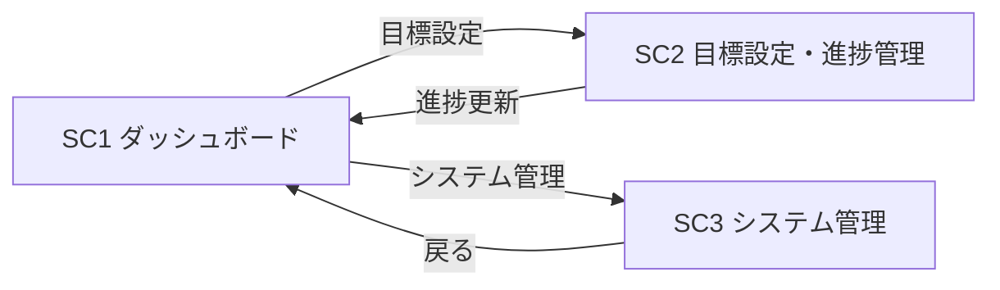
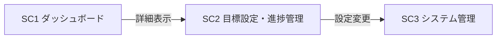

# Torrent4.0 スクリーンフロー

## MVP フロー

## Release1 フロー

## 画面遷移の説明

### MVP
- **SC1 → SC2**: ダッシュボードから目標設定・進捗管理画面へ遷移
- **SC2 → SC1**: 進捗更新後、ダッシュボードに戻る
- **SC1 → SC3**: ダッシュボードからシステム管理画面へ遷移
- **SC3 → SC1**: システム管理完了後、ダッシュボードに戻る

### Release1
- **SC1 → SC2**: ダッシュボードから詳細表示機能で目標設定・進捗管理画面へ遷移
- **SC2 → SC3**: 目標設定・進捗管理画面から設定変更機能でシステム管理画面へ遷移

