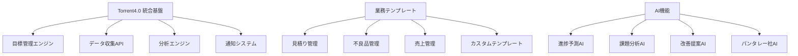
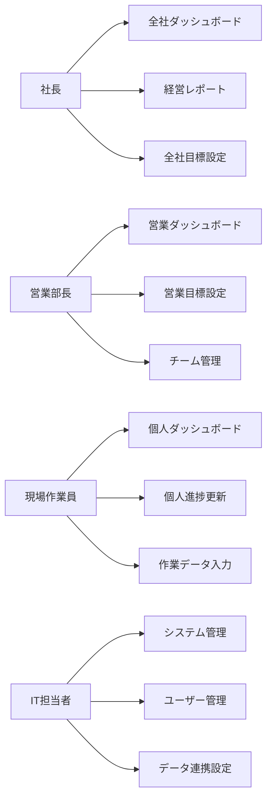
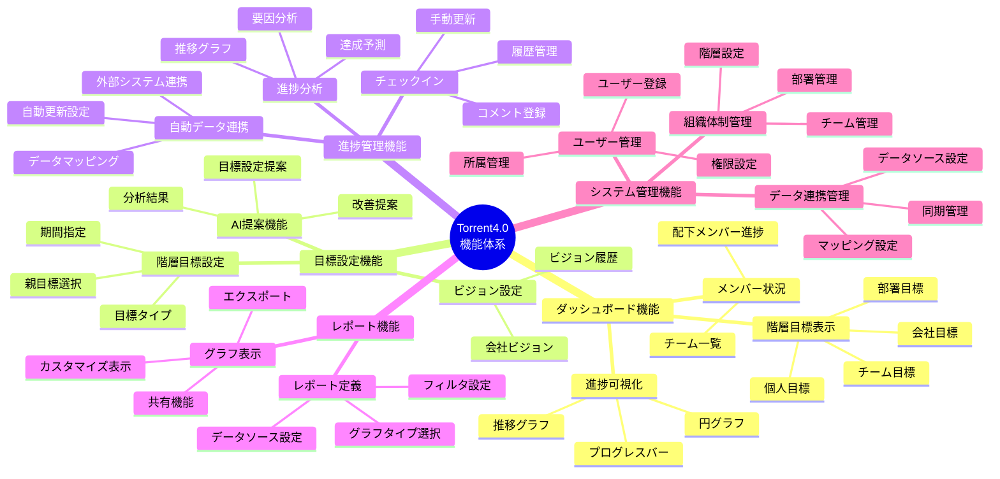
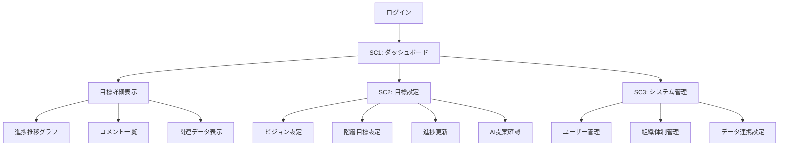
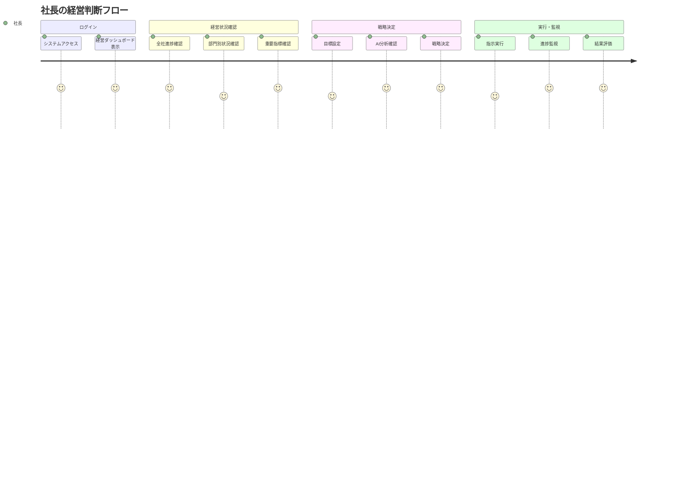
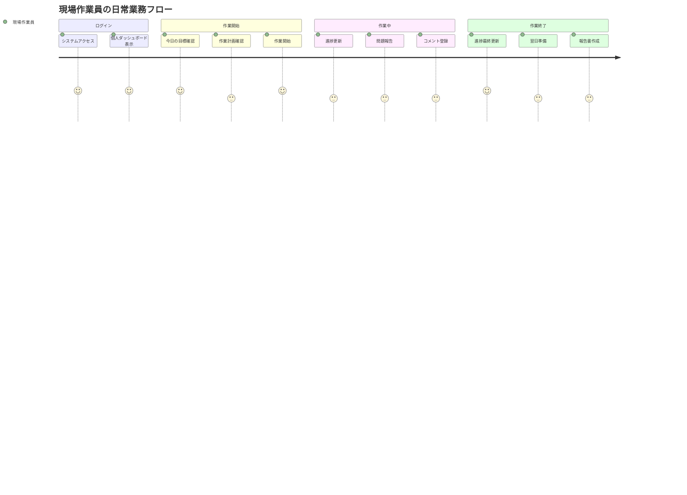

# Torrent4.0 ユーザー導線図設計書

*作成日: 2025年1月15日*  
*プロジェクト: Torrent4.0 統合基盤開発*

---

## 📋 目次

1. [プロジェクト概要](#プロジェクト概要)
2. [システム全体アーキテクチャ](#システム全体アーキテクチャ)
3. [ペルソナ別ユーザー層](#ペルソナ別ユーザー層)
4. [画面・機能階層](#画面機能階層)
5. [ユーザー導線フロー](#ユーザー導線フロー)
6. [データ・情報階層](#データ情報階層)
7. [導線設計の重要ポイント](#導線設計の重要ポイント)
8. [実装優先順位](#実装優先順位)

---

## 🎯 プロジェクト概要

### Torrent4.0とは
**Torrent4.0** = 中小企業向けの**自動目標管理システム**

> 💡 **コンセプト**: 会社のデータを自動で集めて、AIが分析して、目標達成のためのアドバイスをしてくれるシステム

### 解決する課題
- 📊 **データが活用されていない**: 会社にデータはあるけど、うまく使えていない
- ⏰ **手作業が多すぎる**: データ収集や分析に時間がかかりすぎる
- 💰 **コストが高い**: DX化したいけど、お金や人材が足りない
- 🤷 **何をすればいいかわからない**: DXの進め方がわからない

### 提供する価値
- 🤖 **自動化**: データ収集・分析が自動で行われる
- 📈 **効率化**: 目標達成のためのアドバイスが自動で提案される
- 💡 **簡単**: 既存のシステムと連携してすぐに使える
- 🎯 **成果**: データドリブンな経営が実現できる

---

## 🏗️ システム全体アーキテクチャ

### 統合基盤構成



### 技術スタック

| 層 | 技術要素 | 詳細 |
|---|---|---|
| **フロントエンド** | React/Vue.js | ダッシュボード、管理画面 |
| **バックエンド** | Torrentフレームワーク | API Gateway、統合基盤 |
| **AI・分析** | パンタレー社AI | データ分析エンジン |
| **インフラ** | クラウド基盤 | データベース、運用監視 |

---

## 👥 ペルソナ別ユーザー層

### 主要ペルソナ

#### 1. 田中健一（営業部長）- 最優先ペルソナ
- **役割**: 営業部の目標管理・チーム管理
- **主要ニーズ**: 営業データの可視化、チーム進捗管理
- **利用頻度**: 毎日

#### 2. 山田太郎（社長）- 高優先ペルソナ
- **役割**: 全社の経営判断・戦略決定
- **主要ニーズ**: 経営データの可視化、全社目標設定
- **利用頻度**: 週2-3回

#### 3. 佐藤美咲（現場作業員）- 中優先ペルソナ
- **役割**: 個人目標の達成・進捗報告
- **主要ニーズ**: 個人進捗管理、作業データ入力
- **利用頻度**: 毎日

#### 4. 鈴木一郎（IT担当者）- 中優先ペルソナ
- **役割**: システム管理・データ連携設定
- **主要ニーズ**: ユーザー管理、システム連携
- **利用頻度**: 週1-2回

### ペルソナ別アクセス権限



---

## 🖥️ 画面・機能階層

### メイン画面構成（SC1-SC3）

| 画面ID | 画面名 | 主要機能 | 対象ペルソナ |
|---|---|---|---|
| **SC1** | ダッシュボード | 目標・進捗の可視化 | 全ペルソナ |
| **SC2** | 目標設定・進捗管理 | 目標設定と進捗更新 | 全ペルソナ |
| **SC3** | システム管理 | ユーザー・組織管理 | IT担当者 |

### 機能別詳細階層



### 画面遷移フロー



---

## 🔄 ユーザー導線フロー

### 営業部長の典型的な利用フロー


### 社長の経営判断フロー



### 現場作業員の日常業務フロー



---

## 📊 データ・情報階層

### データ構造階層

```
企業データ
├── ビジョン・戦略
│   ├── 会社ビジョン
│   ├── 中期戦略
│   └── 年度方針
├── 組織データ
│   ├── 会社
│   ├── 部署
│   ├── チーム
│   └── 個人
├── 目標データ
│   ├── 全社目標
│   ├── 部署目標
│   ├── チーム目標
│   └── 個人目標
├── 進捗データ
│   ├── 手動更新データ
│   ├── 自動収集データ
│   └── 履歴データ
└── 分析データ
    ├── レポート定義
    ├── グラフデータ
    └── AI分析結果
```

### 権限・アクセス階層

```
システム管理者
├── 全機能アクセス
├── ユーザー管理
├── 組織管理
└── システム設定

部門管理者
├── 部門ダッシュボード
├── 部門目標設定
├── チーム管理
└── 進捗管理

一般ユーザー
├── 個人ダッシュボード
├── 個人目標設定
├── 進捗更新
└── コメント機能
```

### データ連携階層

```
外部システム
├── Excel/CSV
├── 既存ERP
├── 会計システム
└── その他業務システム

Torrent4.0統合基盤
├── データ収集API
├── データ変換エンジン
├── データ統合DB
└── 分析エンジン

業務テンプレート
├── 見積り管理
├── 不良品管理
├── 売上管理
└── カスタムテンプレート
```

---

## 🎯 導線設計の重要ポイント

### ユーザビリティ要件

#### 基本要件
- **直感的なナビゲーション**: 3クリック以内で主要機能にアクセス
- **階層的な情報表示**: 組織階層に沿った情報構造
- **リアルタイム更新**: 進捗状況の即座な反映
- **レスポンシブデザイン**: PC・タブレット・スマートフォン対応

#### パフォーマンス要件
- **レスポンス時間**: 画面表示3秒以内、API応答1秒以内
- **可用性**: システム可用性99.9%以上
- **スケーラビリティ**: 同時接続ユーザー1,000人対応

### 導線最適化の要素

#### ペルソナ別カスタマイズ
- **役職に応じた画面構成**: 各ペルソナの業務に最適化
- **権限ベースの機能表示**: 必要な機能のみ表示
- **個人設定の保存**: ユーザー別レイアウトカスタマイズ

#### AI支援機能
- **目標設定の自動化**: AIによる目標提案
- **進捗分析の自動化**: データ分析とインサイト生成
- **改善提案の自動化**: アクションプランの提案

#### データ連携
- **既存システムとのシームレス連携**: データ移行の簡素化
- **リアルタイムデータ同期**: 最新データの即座反映
- **データ品質管理**: 整合性と正確性の確保

#### 通知・アラート
- **重要な情報の適切な配信**: プッシュ通知、メール通知
- **アラートの優先度管理**: 緊急度に応じた通知
- **通知設定のカスタマイズ**: ユーザー別通知設定

---

## 📈 実装優先順位

### 第1優先度（MVP必須）

#### 基盤機能
1. **認証・認可システム**
   - JWT トークンベース認証
   - ロールベースアクセス制御
   - 多要素認証対応

2. **データベース設計・構築**
   - 目標管理データベース
   - ユーザー管理データベース
   - 進捗履歴データベース

3. **API基盤構築**
   - RESTful API設計
   - API Gateway実装
   - エラーハンドリング

#### コア機能
1. **ダッシュボード機能**
   - 階層目標表示
   - 進捗可視化
   - メンバー状況表示

2. **目標設定機能**
   - ビジョン設定
   - 階層目標設定
   - 目標コメント機能

3. **進捗管理機能**
   - チェックイン機能
   - 進捗推移グラフ
   - 進捗履歴管理

4. **システム管理機能**
   - ユーザー管理
   - ロール管理
   - 体制管理

### 第2優先度（MVP重要）

#### 分析・レポート機能
1. **レポート機能**
   - レポート定義
   - グラフ表示
   - エクスポート機能

2. **データ収集機能**
   - 外部データ収集設定
   - データマッピング
   - 自動更新設定

3. **マスタデータ連携**
   - torrent業務システムとの連携
   - データ同期機能
   - エラー処理

### 第3優先度（MVP拡張）

#### AI・高度機能
1. **AI業務支援**
   - AI管理画面
   - チャットボット
   - データ分析・提案

2. **業務システム管理**
   - 業務システム有効化・無効化
   - 契約期間管理
   - データ保持管理

3. **ユーザー別レイアウトカスタマイズ**
   - ロゴ設定
   - テーマカラー変更
   - レイアウト変更

---

## 📋 次のステップ

### 短期目標（1-2ヶ月）
1. **プロトタイプの作成**
   - 主要画面のモックアップ
   - 基本導線の検証
   - ユーザビリティテスト

2. **技術実装の詳細化**
   - API仕様の確定
   - データベース設計の詳細化
   - セキュリティ要件の確定

### 中期目標（3-6ヶ月）
1. **MVP機能の実装**
   - 第1優先度機能の実装
   - 統合テストの実施
   - パフォーマンステスト

2. **ユーザーテストの実施**
   - 平野鉄工さんでのPoC
   - フィードバック収集
   - 機能改善

### 長期目標（6-12ヶ月）
1. **本格運用開始**
   - MVPの本格運用
   - 他企業への展開
   - マーケットプレイスの構築

---

## 📞 連絡先・問い合わせ

### プロジェクトチーム
- **プロジェクトマネージャー**: 橘田さん（株式会社Giving First）
- **技術責任者**: 劉さん（Smallit）
- **AI開発責任者**: 田中さん（PantaRhei社）
- **営業・企画責任者**: 瀬木さん（Smallit社代表取締役）

### 連絡方法
- **Microsoft Teams**: Torrent4.0開発チーム
- **Notion**: DB04_議事録
- **定期会議**: 週次開発管理定例会

---

*📅 最終更新: 2025年1月15日*  
*👤 記録者: 開発チーム*  
*📊 情報源: プロジェクト全体像、MVP機能要件マップ、ユーザーストーリー一覧、機能詳細設計*
