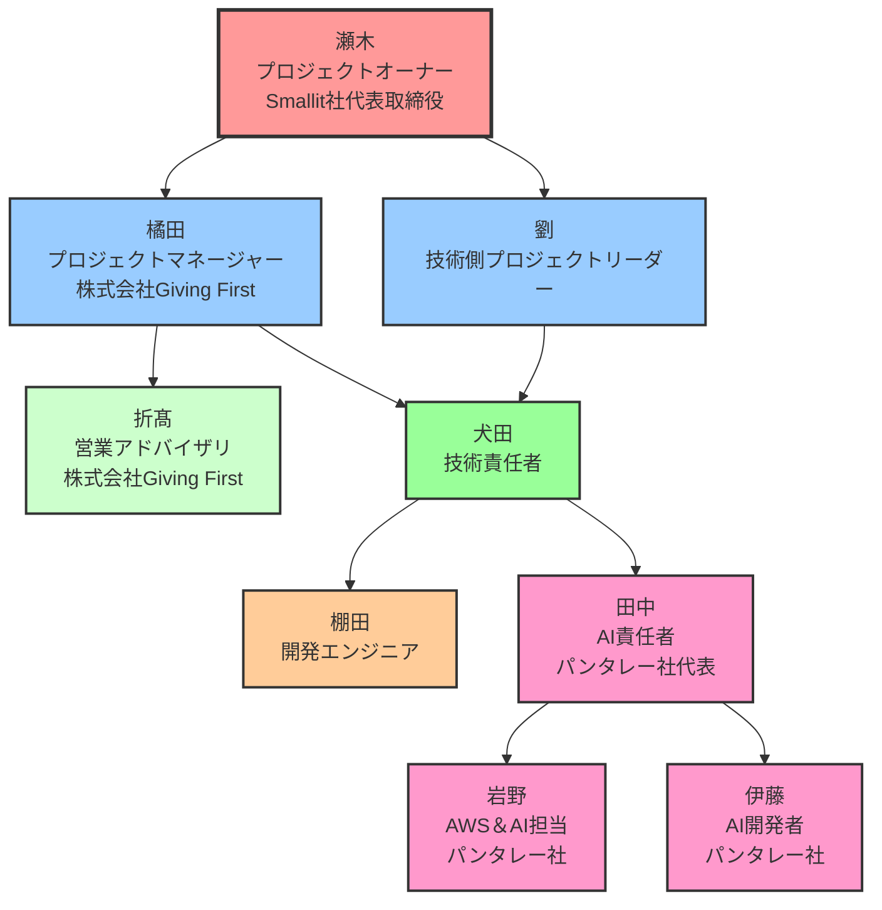

# Torrent4.0 プロジェクト 役割分担表（星取り表）

*2025年1月15日 最新版*

---

## 📋 役割分担表の概要

### 🎯 目的
- 各担当者の責任範囲と役割を明確化
- タスクの重複や漏れを防止
- 効率的なチーム運営の実現

### 📊 評価基準
- ●: メイン担当者（Primary Owner）
- ◯: サブ担当者（Secondary Owner）
- △: 支援・協力者（Support）
- 🔄: 進行中（In Progress）
- ✅: 完了（Completed）
- 📋: 計画中（Planned）

---

## 👥 チームメンバー一覧

| メンバー | 役職 | 主な専門領域 |
|----------|------|-------------|
| **瀬木** | プロジェクトオーナー（Smallit社代表取締役） | 経営判断、意思決定、リソース配分 |
| **橘田** | プロジェクトマネージャー（株式会社Giving First） | プロジェクト全体管理、戦略立案 |
| **劉** | 技術側プロジェクトリーダー | 技術統括、開発管理 |
| **折髙** | 営業アドバイザリ（株式会社Giving First） | 営業支援 |
| **犬田** | 技術責任者 | 技術アーキテクチャ、技術戦略 |
| **棚田** | 開発エンジニア | 開発実装、システム構築 |
| **田中** | AI責任者（パンタレー社代表） | AI戦略、AI技術責任 |
| **岩野** | AWS＆AI担当（パンタレー社） | AI技術実装、インフラ |
| **伊藤** | AI開発者（パンタレー社） | AI機能開発、AI技術実装 |

---

## 🏢 組織図

### 📋 組織階層の説明

| 階層 | 役割 | メンバー | 責任範囲 |
|------|------|----------|----------|
| **L1** | プロジェクトオーナー | 瀬木 | 経営判断、意思決定、リソース配分 |
| **L2** | プロジェクト管理 | 橘田、劉 | プロジェクト全体管理、技術統括 |
| **L3** | 営業・技術責任 | 折髙、犬田 | 営業支援、技術アーキテクチャ、技術戦略 |
| **L4** | 開発実装 | 棚田、田中、岩野、伊藤 | 開発実装、AI機能開発 |

---

## 📊 役割分担表（星取り表）

### 🏗️ プロジェクト管理・運営

| タスク/責任範囲 | 瀬木 | 橘田 | 劉 | 折髙 | 犬田 | 棚田 | 田中 | 岩野 | 伊藤 |
|------------------|----------|----------|----------|----------|----------|----------|----------|----------|----------|
| **プロジェクト全体管理** | ◯ | ● | ◯ | △ | △ | △ | △ | △ | △ |
| **スプリント運用** | △ | ◯ | ● | △ | △ | △ | △ | △ | △ |
| **チーム体制管理** | ◯ | ● | ◯ | △ | △ | △ | △ | △ | △ |
| **進捗管理・報告** | ◯ | ● | ◯ | △ | △ | △ | △ | △ | △ |
| **リスク管理** | ◯ | ● | ◯ | △ | △ | △ | △ | △ | △ |
| **品質管理** | △ | ◯ | ◯ | △ | ● | ◯ | △ | △ | △ |
| **会議体運営** | ◯ | ● | ◯ | △ | △ | △ | △ | △ | △ |

### 🔧 技術開発・実装

| タスク/責任範囲 | 瀬木 | 橘田 | 劉 | 折髙 | 犬田 | 棚田 | 田中 | 岩野 | 伊藤 |
|------------------|----------|----------|----------|----------|----------|----------|----------|----------|----------|
| **技術アーキテクチャ設計** | △ | △ | ◯ | △ | ● | ◯ | ◯ | ◯ | △ |
| **フレームワーク開発** | △ | △ | ◯ | △ | ● | ◯ | △ | ◯ | △ |
| **基盤システム構築** | △ | △ | ◯ | △ | ● | ● | △ | ◯ | △ |
| **API開発** | △ | △ | ◯ | △ | ◯ | ● | △ | ◯ | △ |
| **データベース設計** | △ | △ | ◯ | △ | ◯ | ◯ | △ | ◯ | △ |
| **フロントエンド開発** | △ | △ | ◯ | △ | ◯ | ◯ | △ | △ | △ |
| **バックエンド開発** | △ | △ | ◯ | △ | ◯ | ● | △ | ◯ | △ |
| **インフラ構築** | △ | △ | ◯ | △ | ◯ | ◯ | △ | ● | △ |

### 🤖 AI機能・データ分析

| タスク/責任範囲 | 瀬木 | 橘田 | 劉 | 折髙 | 犬田 | 棚田 | 田中 | 岩野 | 伊藤 |
|------------------|----------|----------|----------|----------|----------|----------|----------|----------|----------|
| **AI構想・戦略** | △ | △ | △ | △ | △ | △ | ● | ◯ | ◯ |
| **AI技術調査** | △ | △ | △ | △ | △ | △ | ● | ◯ | ◯ |
| **AI機能実装** | △ | △ | △ | △ | △ | △ | ◯ | ◯ | ● |
| **データ分析設計** | △ | △ | ◯ | △ | ◯ | △ | ◯ | ◯ | ◯ |
| **BI統合** | △ | △ | ◯ | △ | ◯ | △ | ◯ | ◯ | ◯ |
| **レポート機能** | △ | △ | ◯ | △ | ◯ | △ | ◯ | ◯ | ◯ |
| **パンタレー社連携** | ◯ | ◯ | △ | △ | △ | △ | ● | ◯ | ◯ |

### 🎨 UI/UX・プロトタイプ

| タスク/責任範囲 | 瀬木 | 橘田 | 劉 | 折髙 | 犬田 | 棚田 | 田中 | 岩野 | 伊藤 |
|------------------|----------|----------|----------|----------|----------|----------|----------|----------|----------|
| **UI/UX設計** | △ | △ | ◯ | △ | ◯ | ◯ | △ | △ | △ |
| **プロトタイプ作成** | △ | △ | ◯ | △ | ◯ | ◯ | △ | △ | △ |
| **モックアップ作成** | △ | △ | ◯ | △ | ◯ | ◯ | △ | △ | △ |
| **デモ準備** | ◯ | ◯ | ◯ | ◯ | ◯ | ◯ | △ | △ | △ |
| **画面設計** | △ | △ | ◯ | △ | ◯ | ◯ | △ | △ | △ |
| **ユーザビリティ** | ◯ | ◯ | ◯ | ◯ | ◯ | ◯ | △ | △ | △ |

### 📋 要件定義・設計

| タスク/責任範囲 | 瀬木 | 橘田 | 劉 | 折髙 | 犬田 | 棚田 | 田中 | 岩野 | 伊藤 |
|------------------|----------|----------|----------|----------|----------|----------|----------|----------|----------|
| **要件定義** | ◯ | ● | ◯ | △ | △ | △ | △ | △ | △ |
| **機能設計** | △ | ◯ | ◯ | △ | ● | ◯ | △ | ◯ | △ |
| **システム設計** | △ | ◯ | ◯ | △ | ● | ◯ | △ | ◯ | △ |
| **データ設計** | △ | △ | ◯ | △ | ◯ | ◯ | △ | ◯ | △ |
| **API設計** | △ | △ | ◯ | △ | ◯ | ◯ | △ | ◯ | △ |
| **セキュリティ設計** | △ | ◯ | ◯ | △ | ● | △ | △ | ◯ | △ |

### 🏢 営業・企画・ヒアリング

| タスク/責任範囲 | 瀬木 | 橘田 | 劉 | 折髙 | 犬田 | 棚田 | 田中 | 岩野 | 伊藤 |
|------------------|----------|----------|----------|----------|----------|----------|----------|----------|----------|
| **企業ヒアリング** | ● | ◯ | △ | ◯ | △ | △ | △ | △ | △ |
| **営業戦略** | ● | ● | △ | ◯ | △ | △ | △ | △ | △ |
| **MVP企業選定** | ● | ● | △ | ◯ | △ | △ | △ | △ | △ |
| **顧客対応** | ● | ◯ | △ | ◯ | △ | △ | △ | △ | △ |
| **提案資料作成** | ● | ◯ | △ | ◯ | △ | △ | △ | △ | △ |
| **サービスデザイン** | ● | ● | △ | ◯ | △ | △ | △ | △ | △ |

### 📊 タスク管理・開発プロセス

| タスク/責任範囲 | 瀬木 | 橘田 | 劉 | 折髙 | 犬田 | 棚田 | 田中 | 岩野 | 伊藤 |
|------------------|----------|----------|----------|----------|----------|----------|----------|----------|----------|
| **タスク分解** | ◯ | ● | ◯ | △ | △ | △ | △ | △ | △ |
| **工数見積もり** | ◯ | ● | ◯ | △ | △ | △ | △ | △ | △ |
| **スケジュール管理** | ◯ | ● | ◯ | △ | △ | △ | △ | △ | △ |
| **JIRA管理** | △ | ◯ | ● | △ | △ | △ | △ | △ | △ |
| **エピック管理** | △ | ◯ | ● | △ | △ | △ | △ | △ | △ |
| **テスト管理** | △ | △ | ◯ | △ | ◯ | ● | △ | △ | △ |
| **コードレビュー** | △ | △ | ● | △ | ◯ | ◯ | △ | △ | △ |

### 📚 ドキュメント・知識管理

| タスク/責任範囲 | 瀬木 | 橘田 | 劉 | 折髙 | 犬田 | 棚田 | 田中 | 岩野 | 伊藤 |
|------------------|----------|----------|----------|----------|----------|----------|----------|----------|----------|
| **プロジェクト文書** | ◯ | ● | ◯ | △ | △ | △ | △ | △ | △ |
| **技術文書** | △ | △ | ◯ | △ | ● | ◯ | △ | ◯ | △ |
| **設計書** | △ | △ | ◯ | △ | ● | ◯ | △ | ◯ | △ |
| **運用マニュアル** | △ | ◯ | ◯ | △ | ◯ | ◯ | △ | ◯ | △ |
| **議事録管理** | ◯ | ● | ◯ | △ | △ | △ | △ | △ | △ |
| **知識共有** | ◯ | ● | ◯ | ◯ | ◯ | ◯ | ◯ | ◯ | ◯ |

---

## 🎯 主要責任者マトリクス

### ● メイン担当者（Primary Owner）

| メンバー | 主要責任領域 |
|----------|-------------|
| **瀬木** | 企業ヒアリング、営業戦略、MVP企業選定、顧客対応、提案資料作成 |
| **橘田** | プロジェクト全体管理、営業戦略、要件定義、タスク管理、ドキュメント管理 |
| **劉** | スプリント運用、JIRA管理、エピック管理、コードレビュー |
| **折髙** | 顧客対応、営業支援 |
| **犬田** | 技術アーキテクチャ設計、フレームワーク開発、基盤システム構築、機能設計、システム設計、セキュリティ設計 |
| **棚田** | 基盤システム構築、API開発、バックエンド開発、テスト管理 |
| **田中** | AI構想・戦略、AI技術調査、パンタレー社連携 |
| **岩野** | AI技術実装、インフラ構築、AWS運用 |
| **伊藤** | AI機能実装、データ分析設計、BI統合、レポート機能 |

### 🔄 現在の重点タスク

| メンバー | 現在の重点タスク | 期限 |
|----------|------------------|------|
| **瀬木** | 平野鉄工初回インタビュー日程調整、MVP企業選定 | 10月末 |
| **橘田** | チーム役割分担表作成、プロジェクトドキュメント整備、スプリント運用方針決定 | 10月末 |
| **劉** | エピック構造再検討、JIRA管理、コードレビュー体制確立 | 来週中 |
| **折髙** | 営業支援体制構築、顧客対応準備 | 継続中 |
| **犬田** | 技術アーキテクチャ設計、フレームワーク開発継続 | 継続中 |
| **棚田** | 開発環境構築、基盤システム構築 | 継続中 |
| **田中** | AI戦略策定、パンタレー社連携強化 | 継続中 |
| **岩野** | AI技術実装、AWSインフラ構築 | 継続中 |
| **伊藤** | AI機能実装、データ分析設計 | 継続中 |

---

## 📈 役割分担の特徴

### 🎯 専門性の明確化
- **経営・営業領域**: 瀬木（プロジェクトオーナー）
- **プロジェクト管理領域**: 橘田（プロジェクトマネージャー）
- **開発管理領域**: 劉（技術側プロジェクトリーダー）
- **営業支援領域**: 折髙（営業アドバイザリ）
- **技術領域**: 犬田（技術責任者）、棚田（開発エンジニア）
- **AI・データ領域**: 田中（AI責任者）、岩野（AWS＆AI担当）、伊藤（AI開発者）

### 🤝 協力関係
- **AI機能開発**: 田中（AI戦略） + 岩野（AWS＆AI実装） + 伊藤（AI実装） + パンタレー社（協働）
- **技術開発**: 犬田（技術責任者） + 棚田（開発実装） + 劉（開発管理）
- **企業ヒアリング**: 瀬木（営業） + 橘田（戦略・管理） + 折髙（営業支援）

### 🔄 継続的改善
- 週次レビューで役割分担の見直し
- タスクの進捗に応じた柔軟な役割調整
- 新規メンバーの参画に伴う役割再配分

---

## 📋 次のアクション

### 🎯 短期アクション（1週間以内）
1. **役割分担表の共有**: 全メンバーに配布・確認
2. **責任範囲の明確化**: 各メンバーとの個別確認
3. **タスクの再配分**: 現在の進捗に基づく調整

### 📈 中期アクション（1ヶ月以内）
1. **役割分担の最適化**: 実際の作業負荷に基づく調整
2. **新規エンジニアの役割確定**: 引き継ぎ完了後の正式配分
3. **パフォーマンス評価**: 役割分担の効果測定

---

**📅 作成日**: 2025年1月15日  
**👤 作成者**: G1st Official  
**🔄 更新予定**: 週次レビューで更新

---

*🎯 Torrent4.0 - 明確な役割分担で効率的な開発を実現*

