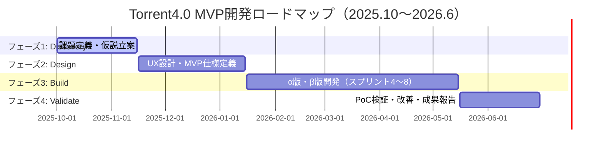

# 🚀 Torrent4.0 MVP開発ロードマップ

<div align="center">

**📅 期間**: 2025年10月〜2026年6月  
**🎯 目標**: 製造業向けAI目標管理システムのMVP完成  
**👥 チーム**: Smallit開発チーム

---

</div>

## 🎯 1. MVP開発のゴール定義

### What＝何を実現するか

| 観点 | ゴール内容 |
|------|------------|
| **🚀 プロダクトゴール** | 製造業向けAI目標管理システム「Torrent4.0」のMVPを完成させ、3社以上でPoC（試行導入）を実施 |
| **💰 ビジネスゴール** | 製造業DX市場におけるPMF仮説を検証し、製品化・資金調達フェーズに移行可能な状態を作る |
| **👥 チームゴール** | 開発・営業・デザインが共通のロードマップを共有し、2週間単位で成果を可視化できる状態を構築 |
| **✅ 品質ゴール** | PoCに耐えうる安定稼働（稼働率99%）、主要KPI（AI助言精度80%以上、操作エラー率5%以下）を達成 |


## 🧩 2. フェーズ設計

### When＝いつ何をするか

| フェーズ | 期間 | 主な成果物 | 管理観点 |
|----------|------|------------|----------|
| **🔍 Phase 1: Discovery**<br/>（課題仮説の定義） | 〜2025年11月 | 顧客課題リスト、ペルソナ、仮説キャンバス | Notionで管理（要件DB） |
| **🎨 Phase 2: Design**<br/>（ソリューション設計） | 〜2026年1月 | MVP仕様書、PoC要件定義、画面フロー | Figma＋Jiraエピック |
| **⚙️ Phase 3: Build**<br/>（MVP開発） | 〜2026年5月 | Torrent4.0α版・β版・PoC版 | Jiraスプリント管理 |
| **📊 Phase 4: Validate**<br/>（検証と改善） | 〜2026年6月 | PoC報告書、改善バックログ | Notion＋Jira統合ビュー |


## 🧠 3. プロジェクトマネジメントテーマ

### How＝どう進めるか

#### 🔹 通常の開発PMとの違い

| 項目 | システム開発型PM | MVP開発型PM |
|------|------------------|-------------|
| **目的** | 要件通りに作る | 仮説を検証して価値を見極める |
| **成果物** | システム | 学びと指標（KPI/KGI） |
| **管理軸** | 進捗・品質・コスト | 仮説・検証・学び |
| **ゴール** | 完成 | PMFに近づくこと |


## 🧭 4. Jira構造

### エピック／スプリント／テーマ

#### 🟣 エピック（戦略軸）

| エピック名 | 内容 | 管理視点 |
|------------|------|----------|
| **EP-01: プロダクトビジョン構築** | 顧客課題・ペルソナ定義、MVPスコープ決定 | Notion連携（課題DB） |
| **EP-02: UX/UI設計** | トライアルユーザーを意識したMVP画面構成 | Figma連携 |
| **EP-03: コア機能開発** | AI目標管理エンジン／データ連携基盤 | 開発スプリント |
| **EP-04: PoC実証・分析** | テスト顧客3社との実証＋KPI計測 | Notion×Jiraデータ統合 |
| **EP-05: 学びの体系化** | 成功要因・失敗要因のドキュメント化 | NotionナレッジDB |


#### 🏃 スプリント（実行軸・2週間単位）

| スプリント | 期間 | ゴール | 評価軸 |
|------------|------|--------|--------|
| **Sprint 1** | 10/14〜10/25 | MVP要件の仮決定 | 顧客課題3件定義 |
| **Sprint 2** | 10/28〜11/8 | UXプロトタイプ初稿完成 | 3ユーザーレビュー実施 |
| **Sprint 3** | 11/11〜11/22 | AI連携構想整理 | 技術検証報告書完成 |
| **Sprint 4〜8** | 12月〜2月 | MVP開発（α→β） | 動作確認・内部テスト |
| **Sprint 9〜12** | 3月〜6月 | PoC運用＋改善 | 定量KPI達成＋意思決定 |


## 🪜 5. Notion連携設計

### ナレッジ・進捗共有

| Notionデータベース | 内容 | Jira連携対象 |
|-------------------|------|-------------|
| **✅ 開発管理定例** | スプリントレビュー議事録 | スプリントレポート |
| **🧭 MVP仮説DB** | 課題・仮説・検証結果 | エピックEP-01 |
| **📊 PoC結果DB** | 顧客テストの結果 | EP-04進捗／KPI測定 |
| **📚 ナレッジDB** | 学び・改善ノート | EP-05出力物 |


## 🧩 6. ガバナンスとリズム

| 項目 | 内容 |
|------|------|
| **📅 定例** | 週次スプリント定例（木曜AM） |
| **🔄 レビュー** | 各スプリント終了時に成果デモ＋ふりかえり |
| **📊 ステコミ** | 月次でSmallit経営層向け報告 |
| **📚 ドキュメント** | Notionで全議事録・設計資料を一元管理 |


## ⚠️ 7. 成功のためのリスク管理

| リスク | 対応策 |
|--------|--------|
| **📈 スコープ肥大化** | MVP原則「1つの課題×1つの機能」で絞る |
| **🔍 仮説のまま進行** | 毎スプリントで「検証項目」を設定 |
| **🌡️ 関係者の温度差** | Notion＋Jiraの可視化で透明性確保 |
| **👥 開発リソース不足** | 外部委託・AI自動化による補完を検討 |


## 🧭 8. 全体ロードマップ




---

## 💡 次のステップ提案

### 🎯 優先度順のアクションアイテム

1. **📋 MVP開発ゴール定義シート**（Notionテンプレート）を作成
   - ゴール・KPI・仮説・検証方法を1ページに整理

2. **📊 Jiraエピック構造を反映したスプリント計画表**（Googleスプレッドシート）を作成
   - スプリント進行とリソース見積りを連動管理

3. **🔄 Notion ⇄ Jira連携**（n8n or Zapier）の自動化フロー設計
   - 議事録更新時にJiraタスクを自動生成

---

## 🚀 追加作成可能な資料

ご希望があれば次のどちらかを生成できます：

- **① MVP開発ゴール定義シート**（Notion用テンプレート）
- **② Jiraプロジェクト設計図**（エピック・スプリント・タスク階層Mermaid図）

**どちらを先に作りますか？**

---

<div align="center">

**📅 最終更新**: 2025年10月8日  
**👤 作成者**: 開発チーム  
**🔄 次回更新予定**: スプリント進行に基づき随時更新

---

*🚀 Torrent4.0 MVP開発ロードマップ - 製造業向けAI目標管理システム*

</div>


# 🧩 Jiraプロジェクト設計図：Torrent4.0 MVP開発

## 🔧 プロジェクト設定
- **プロジェクト名**：Smallit_Torrent4.0
- **キー**：SMT
- **管理方法**：スクラム（2週間スプリント）
- **メンバー**：
  - プロジェクトマネージャー：稲葉（Giving First）
  - 開発責任者：瀬木（Smallit）
  - 技術統括：北
  - デザインリード：ちょまど
  - 営業・PoC支援：田中

---

## 🟣 エピック構成

| エピックID | 名称 | 目的 | 成果物 |
|-------------|------|------|--------|
| EP-01 | プロダクトビジョン構築 | MVPスコープ・顧客課題整理 | 仮説キャンバス／要件定義書 |
| EP-02 | UX/UI設計 | MVPに必要な画面・体験を設計 | 画面フロー／Figma |
| EP-03 | コア機能開発 | AI・DB連携・PDCAエンジン構築 | MVPアプリ（α→β版） |
| EP-04 | PoC実証・改善 | 実証運用＋学びの体系化 | PoC報告書・改善計画 |

---

## 🏃 スプリント設計（2週間）

| Sprint | 期間 | 目的 | 主要タスク |
|---------|------|------|-------------|
| Sprint 1 | 10/14〜10/25 | MVPスコープ確定 | 仮説定義・課題DB構築 |
| Sprint 2 | 10/28〜11/8 | UX初稿設計 | Figma初版作成 |
| Sprint 3 | 11/11〜11/22 | AI連携検討 | データ構造整理・PoC設計 |
| Sprint 4 | 12/2〜12/13 | MVP α版構築 | 主要機能実装 |
| Sprint 5 | 12/16〜12/27 | 内部レビュー | α→β改善 |
| Sprint 6 | 1/6〜1/17 | β版完成 | テスト・安定化 |
| Sprint 7 | 2/3〜2/14 | PoC準備 | 導入環境構築 |
| Sprint 8 | 3/3〜3/14 | PoC実施 | 顧客データ連携 |
| Sprint 9 | 4/1〜4/12 | 改善・UI最適化 | ユーザーフィードバック反映 |
| Sprint 10 | 5/1〜5/15 | β最終安定版 | 成果報告準備 |
| Sprint 11 | 6/1〜6/15 | PoC報告 | MVP評価・次期提案 |
| Sprint 12 | 6/16〜6/30 | 総括・ロードマップ更新 | フェーズ2移行設計 |

---

## 🧠 Mermaid構造図

```mermaid
graph TD
    A[SMT-Project: Torrent4.0 MVP] --> B[EP-01: ビジョン構築]
    A --> C[EP-02: UX/UI設計]
    A --> D[EP-03: コア機能開発]
    A --> E[EP-04: PoC実証・改善]

    B --> B1[課題ヒアリング]
    B --> B2[仮説キャンバス作成]
    B --> B3[MVPスコープ確定]

    C --> C1[ユーザーフロー設計]
    C --> C2[画面ワイヤー作成]
    C --> C3[Figma共有]

    D --> D1[AI分析エンジン構築]
    D --> D2[DB・API接続]
    D --> D3[PDCAロジック検証]

    E --> E1[PoC環境構築]
    E --> E2[顧客データ検証]
    E --> E3[KPI分析・改善提案]