# 🚀 Torrent4.0 プロジェクト全体像（プロジェクト憲章）
*2025年1月15日 最新版*

---

## 📋 プロジェクト憲章

### 🎯 プロジェクト概要

**プロジェクト名**: Torrent4.0  
**プロジェクト期間**: 2025年10月1日 ～ 2026年6月30日  
**プロジェクトオーナー**: 関さん（Smallit社代表取締役）  
**プロジェクトマネージャー**: 橘田さん（株式会社Giving First）

### 🌟 プロジェクトの背景・経緯

#### **社会的背景**
- **中小企業のDX化推進**: 2018年以降、国・自治体の後押しにより中小企業のDX化が推進
- **大手企業のDX化必須化**: 大手企業は既にDX取り組みが必須となり、取引先の中小企業にもデジタル対応を求めるケースが増加
- **サプライチェーン全体のDX化**: 受発注システム化など、サプライチェーン全体でのDX化が不可避

#### **業界課題**
- **製造業企業のデータ活用の非効率性**: 企業に転がっているデータを有効活用できていない現状
- **PDCAサイクルの手動管理**: 手動管理による業務効率の低下
- **DX化のコスト・人材不足**: 中小企業の資金・人手・知見不足によりDX化が進まない

#### **プロジェクト発足の経緯**
平野鉄工株式会社とのヒアリング（2025年10月15日実施）を通じて、製造業特有の課題が明確化：
- 見積もり作成に1週間～10日を要する非効率性
- 手書き伝票でのアナログ管理による情報の分散
- 事業別・部署別の収益性把握の困難さ
- 営業担当者1名で60社を担当する業務負荷

### 🎯 プロジェクトの目的・目標

#### **目的**
目標管理のPDCAサイクルをAIで効率化・高度化し、製造業の営業担当者および現場作業員の業務効率を向上させる。企業に転がっているデータを引っ張り出し、AIとかけ合わせて、会計や生産管理などのいろんな文脈で便利に使える統合型システムを構築する。

#### **成功の定義**
**2026年6月頃にMVPを完成させ、何らかのユーザー企業でPoCを行い、夏のシステム系展示会でTorrent4.0を紹介し、本格的な販売に進める状態であること**

#### **具体的目標**
1. **MVP完成**: 2026年6月までに統合基盤（目標管理システム）のMVP完成
2. **PoC実施**: 平野鉄工さん等でのPoC実施と効果検証
3. **展示会出展**: 夏のシステム系展示会での製品紹介
4. **本格販売準備**: 展示会後の本格的な販売体制構築

### 👥 ステークホルダー

#### **プロジェクトスポンサー**
- **関さん**: Smallit社代表取締役（プロジェクトオーナー）

#### **主要ステークホルダー**
- **株式会社Giving First**: プロジェクトマネジメント、営業支援
- **PantaRhei社**: AI機能の協働開発
- **平野鉄工株式会社**: パイロットユーザー

#### **開発チーム**
- **橘田さん**: プロジェクトマネージャー（株式会社Giving First）
- **劉さん**: 技術側プロジェクトリーダー
- **犬田さん**: 技術責任者
- **棚田さん**: 開発エンジニア
- **田中さん**: AI責任者（PantaRhei社代表）
- **岩野さん**: AWS＆AI担当（PantaRhei社）
- **伊藤さん**: AI開発者（PantaRhei社）

### 📊 プロジェクトスコープ

#### **含まれるもの（In Scope）**
1. **統合基盤開発**
   - 認証・認可システム
   - データベース設計・構築
   - API基盤構築
   - 共通コンポーネント開発

2. **コア機能開発**
   - ダッシュボード機能
   - 目標設定機能
   - 進捗管理機能
   - システム管理機能

3. **技術要素開発**
   - AI機能（PantaRhei社協働）
   - BI機能
   - データ収集機能
   - MDM機能

4. **PoC実施**
   - 平野鉄工さんでのPoC
   - 効果測定・検証

#### **含まれないもの（Out of Scope）**
1. **業務テンプレートの詳細設計**: 統合基盤完成後の検討事項
2. **他企業への展開**: MVP完成後の検討事項
3. **展示会準備**: MVP完成後の検討事項

### ⏰ スケジュール・マイルストーン

#### **開発スケジュール（26週間）**
- **Phase 1**: 基盤構築（2025年10月1日-11月15日）
- **Phase 2**: コア機能開発（2025年11月16日-2026年1月15日）
- **Phase 3**: 管理機能開発（2026年1月16日-3月15日）
- **Phase 4**: 技術要素・テスト（2026年3月16日-5月15日）
- **Phase 5**: テスト・リリース準備（2026年5月16日-6月30日）

#### **主要マイルストーン**
- **2025年12月**: 基盤構築完了
- **2026年3月**: コア機能完了
- **2026年6月**: 管理機能完了
- **2026年9月**: 技術要素完了
- **2026年12月**: MVP完成・PoC開始

### 💰 予算・リソース

#### **開発工数**
- **総工数**: 454人日
- **開発期間**: 26週間
- **チーム体制**: 9名

#### **工数内訳**
- 基盤開発タスク: 70日
- 機能別開発タスク: 150日
- 画面別開発タスク: 72日
- 技術要素別開発タスク: 72日
- 共通機能開発タスク: 30日
- テスト・品質保証タスク: 30日
- デプロイ・運用タスク: 30日

### 🎯 成功指標（KPI）

#### **開発KPI**
- **MVP完成**: 2026年6月まで
- **PoC実施**: 平野鉄工さんでのPoC成功
- **品質基準**: レスポンス時間3秒以内、可用性99.9%以上

#### **ビジネスKPI**
- **展示会出展**: 夏のシステム系展示会での製品紹介
- **本格販売準備**: 展示会後の販売体制構築完了

### ⚠️ 主要リスクと対策

#### **技術リスク**
- **AI技術の実装リスク**: 早期技術調査・プロトタイプ作成
- **BI技術の統合リスク**: 技術調査・統合テスト
- **外部システム連携リスク**: 早期統合テスト・代替案準備

#### **スケジュールリスク**
- **工数見積もりの不確実性**: バッファ確保・段階的実装
- **依存関係の複雑さ**: 依存関係整理・並行開発

#### **品質リスク**
- **パフォーマンス要件の実現リスク**: 早期パフォーマンステスト
- **セキュリティ要件の実現リスク**: セキュリティ設計・テスト

### 📋 意思決定プロセス

#### **ステアリングコミッティ**
- **開催頻度**: 定期的
- **意思決定者**: 関さん（プロジェクトオーナー）
- **上申プロセス**: ステアリングコミッティでの関さんへの上申

#### **開発管理**
- **日次**: 開発スクラム定例
- **週次**: AIチーム構想ミーティング
- **月次**: プロジェクトマネージャー内部定例会

### 📈 期待される成果

#### **平野鉄工さんへの効果**
- **見積もり作成時間**: 1週間～10日 → 2-3日（70%短縮）
- **作業時間管理**: 手動入力 → 自動化（90%効率化）
- **経営判断速度**: 月次 → リアルタイム（即座対応）
- **営業効率**: 60社管理 → 最適化された訪問計画（30%向上）

#### **ビジネス成果**
- **MVP完成**: 中小企業向け自動目標管理SaaSの完成
- **PoC成功**: 実証された効果による製品価値の証明
- **展示会出展**: 市場への製品紹介と認知度向上
- **本格販売**: 持続可能なビジネスモデルの確立

### 📝 承認・承認者

**プロジェクト憲章承認者**: 関さん（Smallit社代表取締役）  
**承認日**: 2025年10月1日  
**次回見直し予定**: 2025年12月（基盤構築完了時）

---

## 🎯 Torrent4.0 ビジョン・全体像

### 🌟 プロジェクトの目的と価値

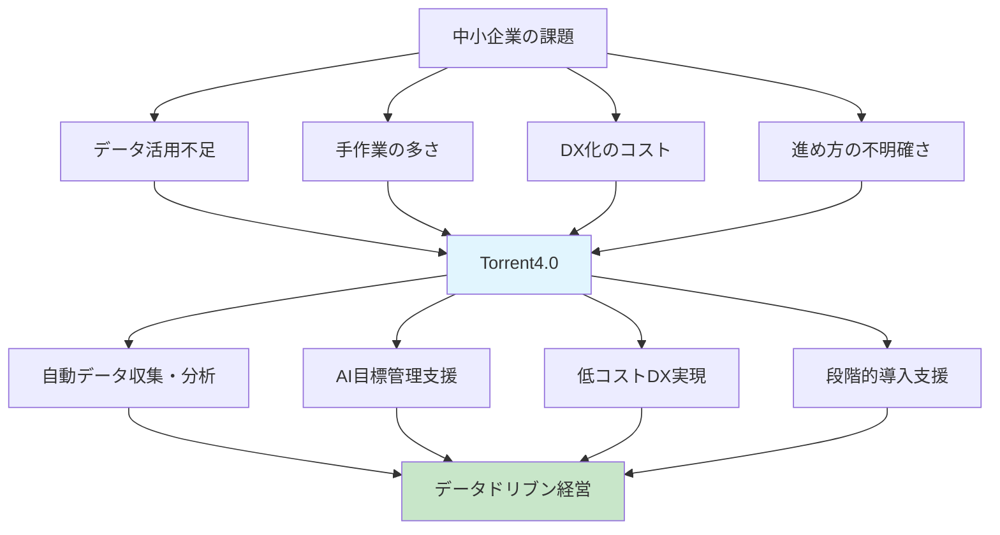

### 👥 ターゲットユーザーと使われ方

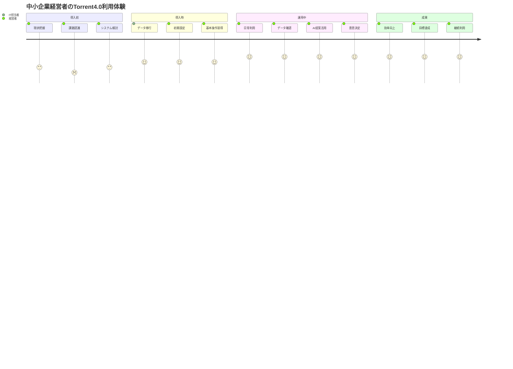

### 🏗️ システム全体アーキテクチャ

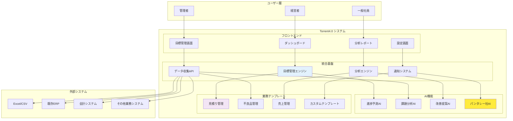

### ⚙️ 主要機能とその関係性

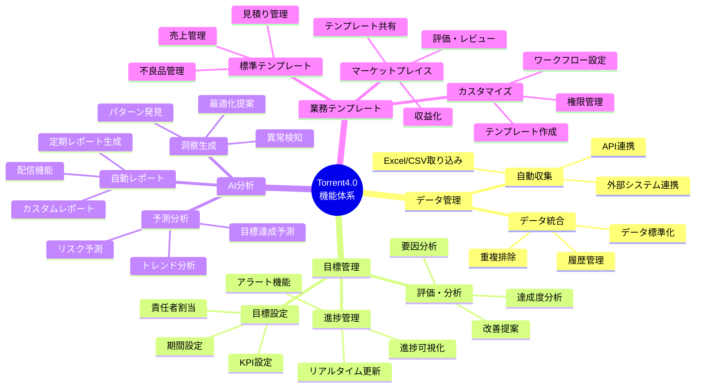

### 🔄 ユーザーの典型的な利用フロー

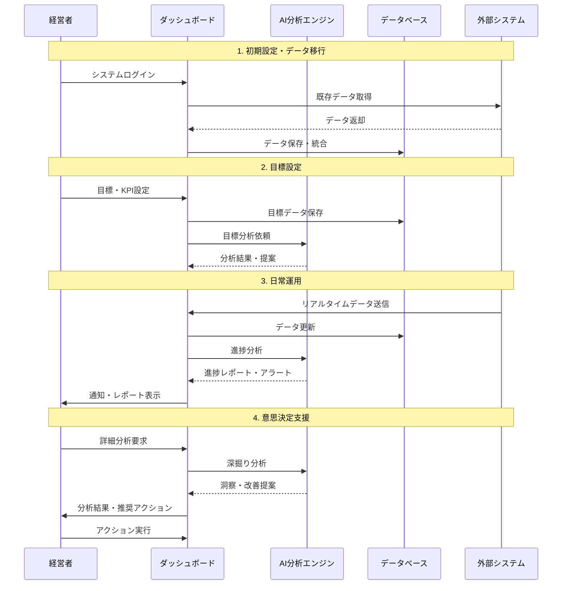

---

## 📋 プロジェクト概要

### 🎯 何を作っているの？
**Torrent4.0** = 中小企業向けの**自動目標管理システム**

> 💡 **簡単に言うと**: 会社のデータを自動で集めて、AIが分析して、目標達成のためのアドバイスをしてくれるシステム

### 🏗️ システムの構成

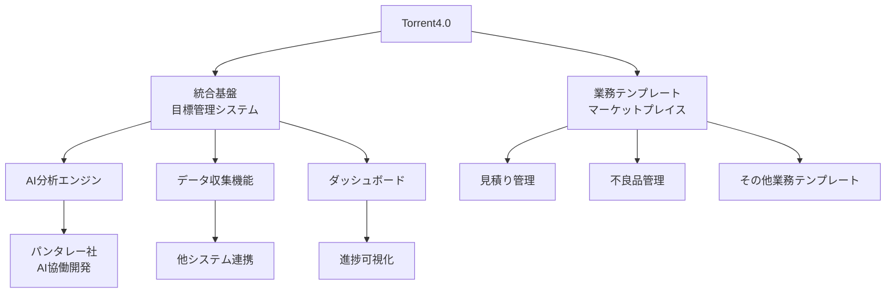

#### 🔧 1. 統合基盤（目標管理システム）
| 項目 | 詳細 |
|------|------|
| **現状** | 🚧 モック作成中 |
| **AI開発** | 🤝 パンタレー社と協働 |
| **機能** | 📊 目標管理の中核機能 |
| **技術** | ⚡ フレームワークバージョンアップ中 |

#### 🛍️ 2. 業務テンプレート（マーケットプレイス）
| 項目 | 詳細 |
|------|------|
| **現状** | 🤔 具体的な内容を検討中 |
| **コンセプト** | 📈 Kintoneのパワーアップ版 |
| **具体例** | 📋 見積り管理、不良品管理など |

### 🎯 解決したい課題

#### ❌ 現在の問題
- 📊 **データが活用されていない**: 会社にデータはあるけど、うまく使えていない
- ⏰ **手作業が多すぎる**: データ収集や分析に時間がかかりすぎる
- 💰 **コストが高い**: DX化したいけど、お金や人材が足りない
- 🤷 **何をすればいいかわからない**: DXの進め方がわからない

#### ✅ 解決後の姿
- 🤖 **自動化**: データ収集・分析が自動で行われる
- 📈 **効率化**: 目標達成のためのアドバイスが自動で提案される
- 💡 **簡単**: 既存のシステムと連携してすぐに使える
- 🎯 **成果**: データドリブンな経営が実現できる

## 📈 最新の開発状況

### 🗓️ 開発タイムライン

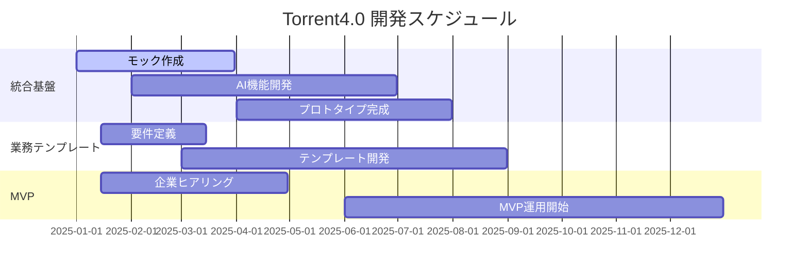

### 🚧 現在の進捗状況（2025年10月1日時点）

#### 📊 開発進捗サマリー
| カテゴリ | 進捗率 | 状況 |
|----------|--------|------|
| **統合基盤** | 45% | 🚧 処理部分構築中 |
| **AI機能** | 30% | 🤝 パンタレー社と協働開発中 |
| **業務テンプレート** | 20% | 🤔 要件検討中 |
| **MVP準備** | 55% | 📋 企業ヒアリング準備中 |
| **開発タスク分解** | 100% | ✅ 完了 |
| **工数見積もり** | 100% | ✅ 完了 |
| **開発スケジュール** | 100% | ✅ 完了 |
| **リスク分析** | 100% | ✅ 完了 |
| **JIRA設定** | 90% | 🔄 プロジェクト名「PRT」に変更中 |
| **エピック構造** | 70% | 🔄 再検討中 |

#### 🎯 直近の重要タスク（2025年10月20日時点）

##### 🔥 今週の重点項目
- [x] **開発タスク分解完了** (開発チーム)
- [x] **工数見積もり完了** (開発チーム)
- [x] **開発スケジュール策定完了** (開発チーム)
- [x] **リスク分析完了** (開発チーム)
- [x] **平野鉄工さんヒアリング実施** (2025年10月15日)
- [ ] **岩野さんに田中さんからの共有状況を確認** (担当: @ito)
- [ ] **必要に応じて田中さんとの調整を実施** (担当: @劉)
- [ ] **テスト結果の発表を明日のタイミングで実施** (担当: @ito)
- [ ] **野平チェックと平野鉄鋼の日程について情報収集** (担当: @t_kitta)
- [ ] **犬田さんが東京でのコーディング作業に着手予定**

##### 📅 来週の予定
- [ ] **次回定例（10月23日または10月13日）**
- [ ] **野平チェック関連のインタビューミーティング日程調整**
- [ ] **平野鉄鋼の第2回打ち合わせ日程調整**
- [ ] **AI機能開発の進捗確認**
- [ ] **統合基盤のモックアップ開発継続**

#### 🤝 チーム体制

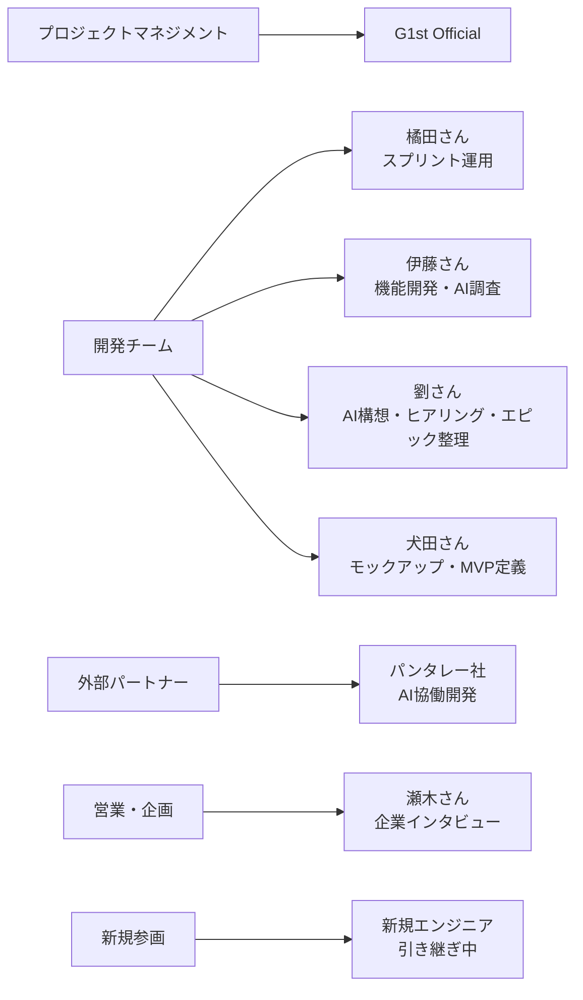

## 🏢 MVPに向けた企業候補

### 🎯 企業選定の戦略

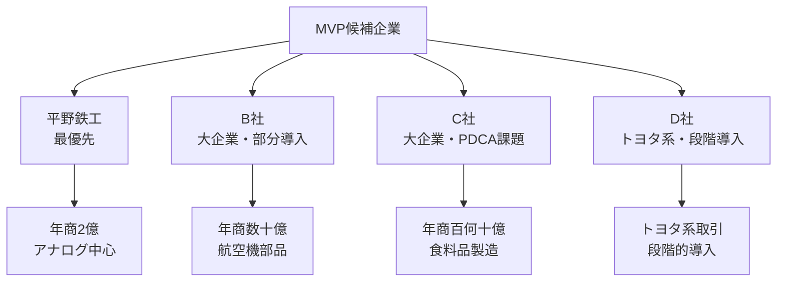

### 📊 企業比較表

| 企業 | 規模 | 業種 | 現状 | ニーズ | 優先度 |
|------|------|------|------|--------|--------|
| **平野鉄工** | 年商2億円 | 鉄工 | 🚫 アナログ中心 | 🔄 全体デジタル化 | ⭐⭐⭐ |
| **B社** | 年商数十億円 | 航空機部品 | ✅ 一部システム化 | 🎯 部分導入 | ⭐⭐ |
| **C社** | 年商百何十億円 | 食料品製造 | ⚠️ PDCA課題 | 🔧 CAサイクル改善 | ⭐⭐ |
| **D社** | トヨタ系 | 製造業 | ✅ システム化済み | 📈 段階的拡大 | ⭐ |

### 🏆 推奨企業: 平野鉄工

#### 🎯 選定理由
- ✅ **シンプルな業務構造**: 複雑すぎない
- ✅ **アナログ中心**: デジタル化の効果が分かりやすい
- ✅ **一気通貫ニーズ**: 全体最適化が可能
- ✅ **エクセルから開始**: 段階的な導入が可能

#### 📋 具体的なアプローチ
1. **Phase 1**: エクセルデータの移行
2. **Phase 2**: 基本的な目標管理機能の導入
3. **Phase 3**: AI分析機能の追加
4. **Phase 4**: 他システムとの連携

#### 📅 進捗状況
- 🗓️ **現在**: 平野鉄工さんとの初回ヒアリング完了（2025年10月15日）
- 🎯 **目標**: 第2回打ち合わせの日程調整中
- 📋 **準備状況**: 開発タスク分解完了により、具体的な実装計画が明確化
- 🔄 **最新動向**: 野平チェック関連のインタビューミーティング日程調整中

## 🔧 技術的進捗

### 🏗️ 技術スタック

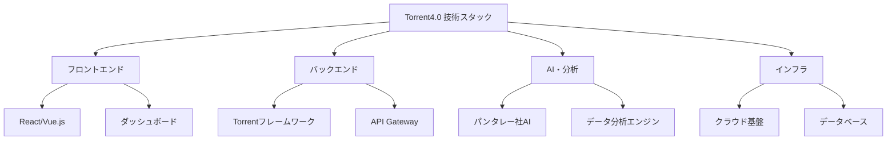

### 📊 技術進捗状況

| 技術領域 | 進捗率 | 詳細 | 担当 |
|----------|--------|------|------|
| **フレームワーク** | 40% | ⚡ バージョンアップ中 | 犬田さん |
| **AI機能** | 25% | 🤝 パンタレー社協働開発 | 劉さん |
| **データ分析** | 20% | 📊 ユースケース具体化中 | 伊藤さん |
| **プロトタイプ** | 30% | 🎨 デモ用モックアップ準備中 | 犬田さん |
| **開発タスク分解** | 100% | ✅ 76タスクに分解完了 | 開発チーム |
| **工数見積もり** | 100% | ✅ 454人日の工数算出完了 | 開発チーム |
| **開発スケジュール** | 100% | ✅ 26週間のスケジュール策定完了 | 開発チーム |
| **リスク分析** | 100% | ✅ 主要リスクと対策策定完了 | 開発チーム |

### 🎯 主要機能の開発状況

#### 🤖 AI機能
- ✅ **パンタレー社との協働体制確立**
- ✅ **AI技術調査タスクの詳細化完了** (TASK-053)
- ✅ **AI統合実装タスクの詳細化完了** (TASK-054)
- ✅ **AI提案機能実装タスクの詳細化完了** (TASK-055)
- 🚧 **AI×目標管理のユースケース具体化**
- 📋 **進捗モニタリング・達成予測機能のタスク切り出し**
- 🎨 **可視化機能のエピック作成**

#### 📊 データ分析
- ✅ **BI技術調査タスクの詳細化完了** (TASK-050)
- ✅ **BI統合実装タスクの詳細化完了** (TASK-051)
- ✅ **レポート生成機能タスクの詳細化完了** (TASK-052)
- 🔄 **データ収集・連携機能の設計**
- 📈 **分析結果の可視化機能**
- 🎯 **目標達成予測アルゴリズム**

#### 🖥️ プロトタイプ
- 🎨 **顧客向けデモ用モックアップ**
- 📱 **システム全体像の説明資料**
- 🎬 **デモンストレーション用動画**

#### 🏗️ 開発基盤
- ✅ **76タスクの詳細分解完了**
- ✅ **454人日の工数見積もり完了**
- ✅ **26週間の開発スケジュール策定完了**
- ✅ **主要リスクと対策の分析完了**
- 🔄 **JIRAプロジェクト名「TRT」に変更中**
- 🔄 **エピック構造の再検討実施中**
- 🆕 **新規エンジニアの参画と引き継ぎ実施中**

## 🎯 今後の重点課題

### ⚡ 短期目標（1-2ヶ月）

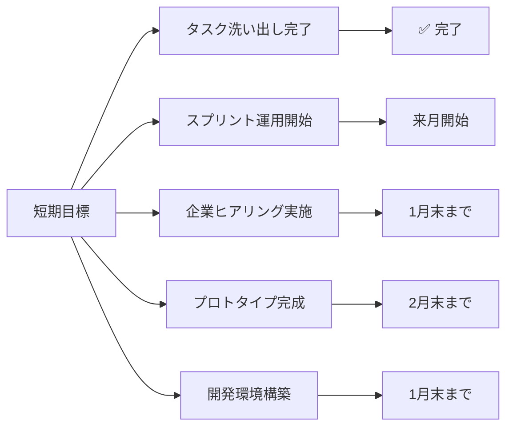

#### 🔥 最優先項目
1. **📋 タスクの全量洗い出し完了** (✅ 完了)
2. **⚙️ スプリント運用方針決定** (来月開始)
3. **🗣️ モニターユーザーへのヒアリング実施** (来週または再来週)
4. **🏢 平野鉄鋼との初回インタビュー実施** (1月末まで)
5. **🏗️ 開発環境構築開始** (1月末まで)
6. **🔄 エピック構造の再検討完了** (来週中)
7. **📊 システムアーキテクチャ関連資料の共有** (劉さん)

### 📈 中期目標（3-6ヶ月）

#### 🎯 主要マイルストーン
1. **🎨 プロトタイプの完成とデモ準備**
2. **🏢 MVP候補企業との詳細ヒアリング**
3. **🤖 AI機能の実装方針確定**
4. **📋 業務テンプレートの具体化**
5. **🏗️ 基盤構築完了** (6週目目標)
6. **⚙️ コア機能開発完了** (12週目目標)

### 🚀 長期目標（6-12ヶ月）

#### 🌟 最終目標
1. **🎉 MVPの本格運用開始**
2. **📈 他企業への展開**
3. **🛍️ マーケットプレイスの構築**

### 📊 成功指標（KPI）

| 指標 | 目標値 | 期限 |
|------|--------|------|
| **企業ヒアリング完了** | 4社 | 3月末 |
| **プロトタイプ完成** | 1つ | 2月末 |
| **基盤構築完了** | 1つ | 6週目 |
| **コア機能開発完了** | 1つ | 12週目 |
| **MVP運用開始** | 1社 | 6月末 |
| **他企業展開** | 3社 | 12月末 |

## 📞 連絡先・問い合わせ

### 👥 プロジェクトチーム
- **プロジェクトマネージャー**: G1st Official
- **技術責任者**: 橘田さん
- **AI開発責任者**: 劉さん
- **営業・企画責任者**: 瀬木さん

### 📧 連絡方法
- **Slack**: #torrent4.0-development
- **Notion**: DB04_議事録
- **定期会議**: 週次開発管理定例会

---

## 📚 参考資料

### 📄 関連ドキュメント
- [ヒアリング記録](./02_課題定義/ヒアリング記録_2025-01-15.md)
- [ペルソナ一覧](./01_ペルソナ作成/ペルソナ一覧.md)
- [開発タスク分解総括](./07_開発タスク分解/開発タスク分解総括.md)
- [工数見積もり](./07_開発タスク分解/工数見積もり.md)
- [開発スケジュール](./07_開発タスク分解/開発スケジュール.md)
- [リスク分析](./07_開発タスク分解/リスク分析.md)
- [README.md](../README.md)

### 🔗 外部リンク
- **Notion議事録**: Smallit社とのMTG議事録（DB04_議事録）
- **最新議事録**: Smallit_torrent_開発管理定例（2025-10-08）

---

**📅 最終更新**: 2025年10月1日  
**👤 記録者**: 開発チーム  
**📊 情報源**: ヒアリング記録 + Notion議事録（2025年10月15日-20日） + 開発タスク分解成果物  
**🔄 次回更新予定**: 進捗に基づき随時更新

## 📋 最新議事録情報（2025年10月20日）

### 🏢 Smallit社開発管理定例（2025年10月20日）

**主要なアクションアイテム：**
1. **岩野さんに田中さんからの共有状況を確認**（担当: @ito）
2. **必要に応じて田中さんとの調整を実施**（担当: @劉）
3. **テスト結果の発表を明日のタイミングで実施**（担当: @ito）
4. **野平チェックと平野鉄鋼の日程について情報収集**（担当: @t_kitta）
5. **犬田さんが東京でのコーディング作業に着手予定**

**スケジュール調整：**
- 次回定例は23日に予定、13日の可能性もあり
- 野平チェック関連のインタビューミーティングの日程は未定
- 平野鉄鋼の第2回打ち合わせの日程も未確定

### 🏭 平野鉄工さんヒアリング会（2025年10月15日）

**主要な課題と解決策：**
1. **見積もりプロセスの効率化**: 1週間から2-3日への短縮
2. **管理会計システムの導入**: 事業部門別収益性の可視化
3. **作業時間管理システム**: スマートフォン入力システムの導入
4. **営業活動の効率化**: 訪問先アラートシステムの検討
5. **DX化の推進**: 愛知県のDX支援プログラム活用

### 🎯 今後の運営方針（2025年10月20日時点）

#### **開発体制の強化**
- **犬田さん**: 東京でのコーディング作業に着手予定
- **AI機能開発**: パンタレー社との連携強化
- **統合基盤**: モックアップ開発の継続

#### **企業ヒアリングの推進**
- **平野鉄工さん**: 第2回打ち合わせの日程調整
- **野平チェック**: インタビューミーティングの実施
- **その他候補企業**: 段階的なヒアリング実施

#### **技術開発の重点項目**
- **AI機能**: 田中さんとの調整と技術共有
- **テスト結果**: 明日のタイミングで発表予定
- **統合基盤**: モックアップの完成とデモ準備

---

*🚀 Torrent4.0 - 中小企業のDXを加速させる自動目標管理システム*

