# 🚀 Torrent4.0 プロジェクト全体像
*2025年1月15日 最新版*

---

## 🎯 Torrent4.0 ビジョン・全体像

### 🌟 プロジェクトの目的と価値

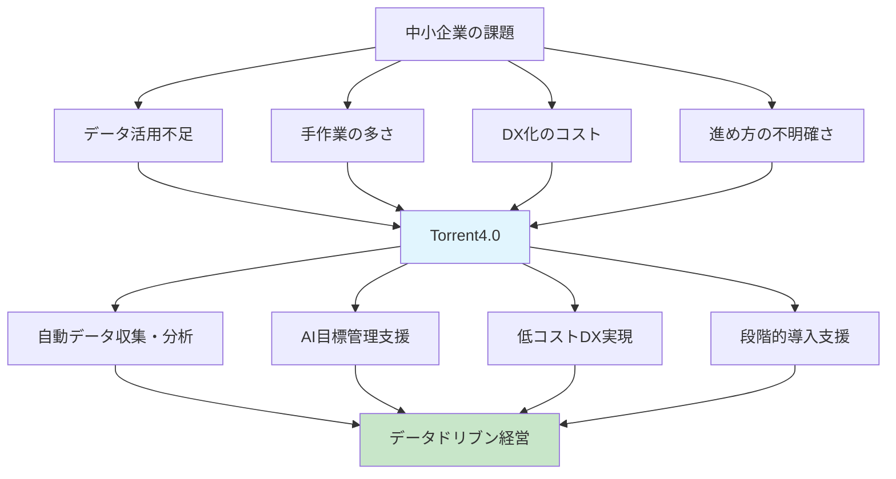

### 👥 ターゲットユーザーと使われ方

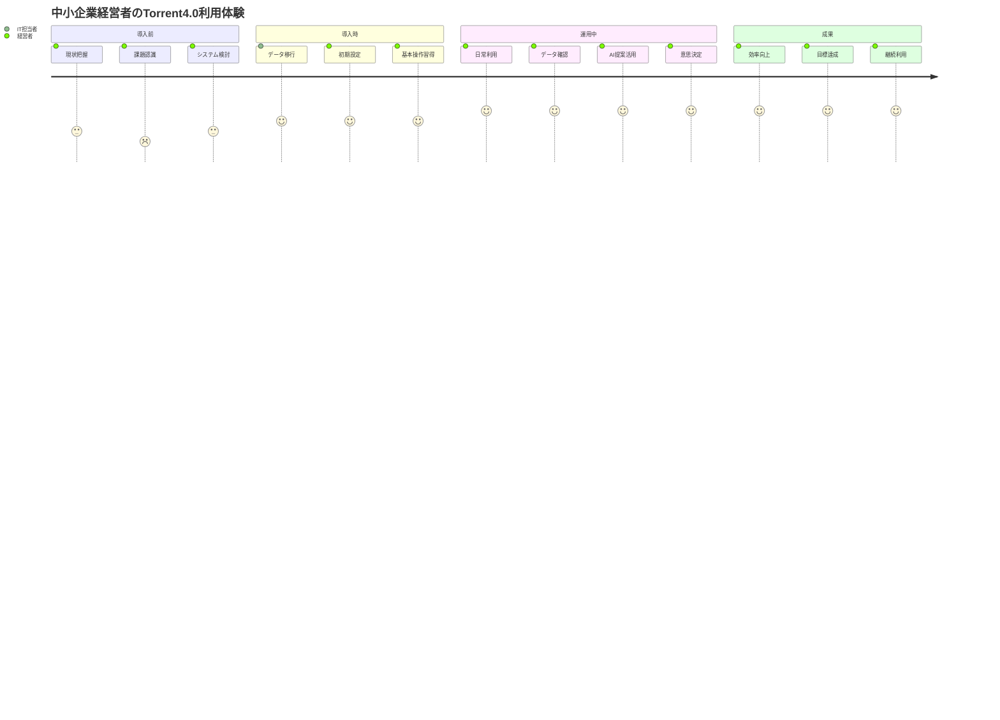

### 🏗️ システム全体アーキテクチャ

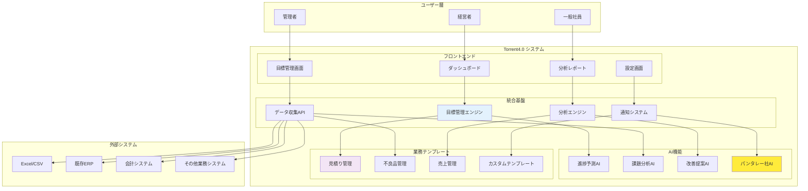

### ⚙️ 主要機能とその関係性

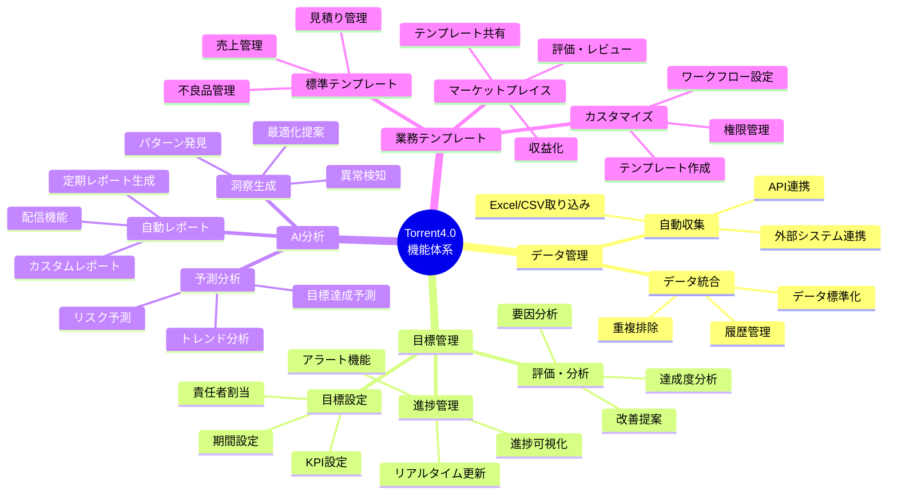

### 🔄 ユーザーの典型的な利用フロー

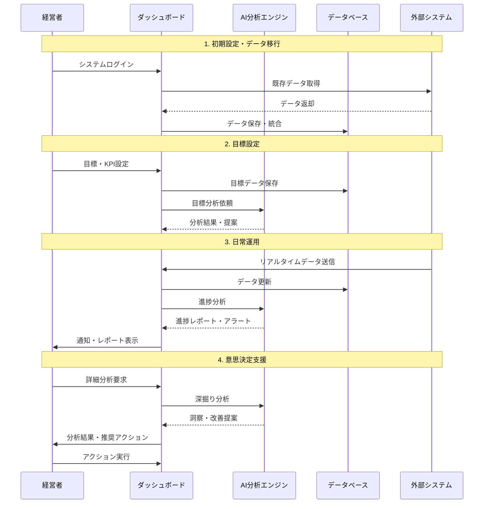

---

## 📋 プロジェクト概要

### 🎯 何を作っているの？
**Torrent4.0** = 中小企業向けの**自動目標管理システム**

> 💡 **簡単に言うと**: 会社のデータを自動で集めて、AIが分析して、目標達成のためのアドバイスをしてくれるシステム

### 🏗️ システムの構成

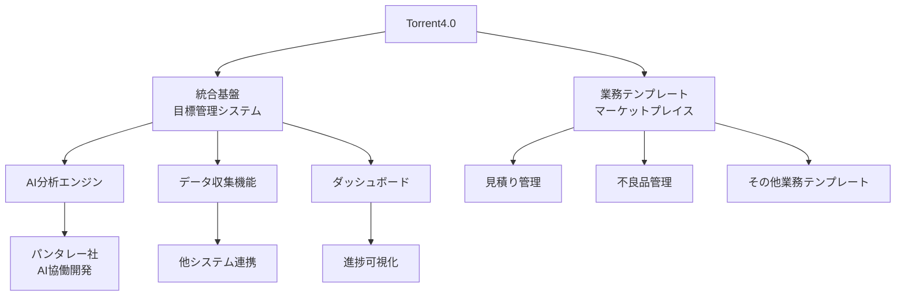

#### 🔧 1. 統合基盤（目標管理システム）
| 項目 | 詳細 |
|------|------|
| **現状** | 🚧 モック作成中 |
| **AI開発** | 🤝 パンタレー社と協働 |
| **機能** | 📊 目標管理の中核機能 |
| **技術** | ⚡ フレームワークバージョンアップ中 |

#### 🛍️ 2. 業務テンプレート（マーケットプレイス）
| 項目 | 詳細 |
|------|------|
| **現状** | 🤔 具体的な内容を検討中 |
| **コンセプト** | 📈 Kintoneのパワーアップ版 |
| **具体例** | 📋 見積り管理、不良品管理など |

### 🎯 解決したい課題

#### ❌ 現在の問題
- 📊 **データが活用されていない**: 会社にデータはあるけど、うまく使えていない
- ⏰ **手作業が多すぎる**: データ収集や分析に時間がかかりすぎる
- 💰 **コストが高い**: DX化したいけど、お金や人材が足りない
- 🤷 **何をすればいいかわからない**: DXの進め方がわからない

#### ✅ 解決後の姿
- 🤖 **自動化**: データ収集・分析が自動で行われる
- 📈 **効率化**: 目標達成のためのアドバイスが自動で提案される
- 💡 **簡単**: 既存のシステムと連携してすぐに使える
- 🎯 **成果**: データドリブンな経営が実現できる

## 📈 最新の開発状況

### 🗓️ 開発タイムライン

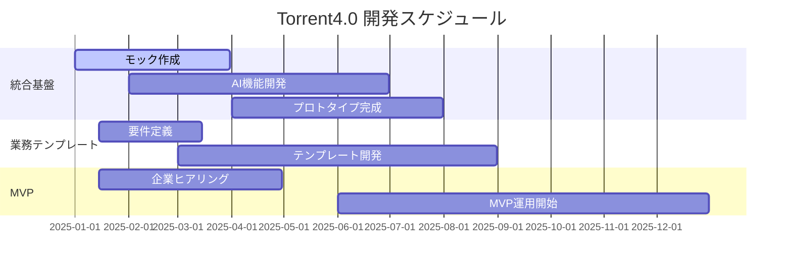

### 🚧 現在の進捗状況（2025年1月15日時点）

#### 📊 開発進捗サマリー
| カテゴリ | 進捗率 | 状況 |
|----------|--------|------|
| **統合基盤** | 45% | 🚧 処理部分構築中 |
| **AI機能** | 30% | 🤝 パンタレー社と協働開発中 |
| **業務テンプレート** | 20% | 🤔 要件検討中 |
| **MVP準備** | 55% | 📋 企業ヒアリング準備中 |
| **開発タスク分解** | 100% | ✅ 完了 |
| **工数見積もり** | 100% | ✅ 完了 |
| **開発スケジュール** | 100% | ✅ 完了 |
| **リスク分析** | 100% | ✅ 完了 |
| **JIRA設定** | 90% | 🔄 プロジェクト名「PRT」に変更中 |
| **エピック構造** | 70% | 🔄 再検討中 |

#### 🎯 直近の重要タスク

##### 🔥 今週の重点項目
- [x] **開発タスク分解完了** (開発チーム)
- [x] **工数見積もり完了** (開発チーム)
- [x] **開発スケジュール策定完了** (開発チーム)
- [x] **リスク分析完了** (開発チーム)
- [x] **JIRAプロジェクト名「PRT」に変更** (開発チーム)
- [ ] **エピック構造の再検討** (劉さん)
- [ ] **進捗モニタリング機能のタスク切り出し** (伊藤さん)
- [ ] **可視化機能のエピック作成** (伊藤さん)
- [ ] **AI構想検討ミーティング** (劉さん)
- [ ] **過去のMVP定義資料の共有と再定義** (犬田さん)

##### 📅 来週の予定
- [ ] **モニターユーザーへのヒアリング実施** (劉さん)
- [ ] **平野鉄鋼との初回インタビュー** (瀬木さん)
- [ ] **デモ用モックアップ準備** (犬田さん)
- [ ] **開発環境構築開始** (開発チーム)
- [ ] **サービスデザイン会議** (10月14日)
- [ ] **システムアーキテクチャ関連資料の共有** (劉さん)

#### 🤝 チーム体制

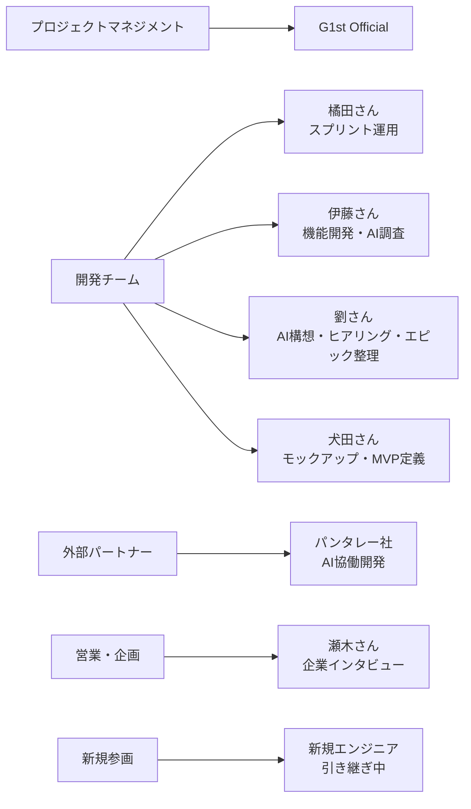

## 🏢 MVPに向けた企業候補

### 🎯 企業選定の戦略

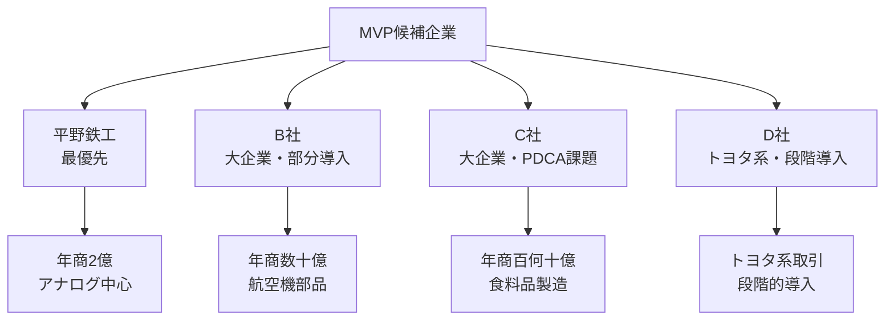

### 📊 企業比較表

| 企業 | 規模 | 業種 | 現状 | ニーズ | 優先度 |
|------|------|------|------|--------|--------|
| **平野鉄工** | 年商2億円 | 鉄工 | 🚫 アナログ中心 | 🔄 全体デジタル化 | ⭐⭐⭐ |
| **B社** | 年商数十億円 | 航空機部品 | ✅ 一部システム化 | 🎯 部分導入 | ⭐⭐ |
| **C社** | 年商百何十億円 | 食料品製造 | ⚠️ PDCA課題 | 🔧 CAサイクル改善 | ⭐⭐ |
| **D社** | トヨタ系 | 製造業 | ✅ システム化済み | 📈 段階的拡大 | ⭐ |

### 🏆 推奨企業: 平野鉄工

#### 🎯 選定理由
- ✅ **シンプルな業務構造**: 複雑すぎない
- ✅ **アナログ中心**: デジタル化の効果が分かりやすい
- ✅ **一気通貫ニーズ**: 全体最適化が可能
- ✅ **エクセルから開始**: 段階的な導入が可能

#### 📋 具体的なアプローチ
1. **Phase 1**: エクセルデータの移行
2. **Phase 2**: 基本的な目標管理機能の導入
3. **Phase 3**: AI分析機能の追加
4. **Phase 4**: 他システムとの連携

#### 📅 進捗状況
- 🗓️ **現在**: 瀬木さんが初回インタビューの日程調整中
- 🎯 **目標**: 1月末までに初回ヒアリング完了
- 📋 **準備状況**: 開発タスク分解完了により、具体的な実装計画が明確化
- 🔄 **最新動向**: モニターユーザーへのヒアリングを来週または再来週に実施予定

## 🔧 技術的進捗

### 🏗️ 技術スタック

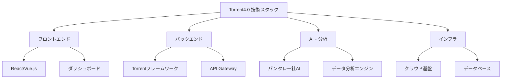

### 📊 技術進捗状況

| 技術領域 | 進捗率 | 詳細 | 担当 |
|----------|--------|------|------|
| **フレームワーク** | 40% | ⚡ バージョンアップ中 | 犬田さん |
| **AI機能** | 25% | 🤝 パンタレー社協働開発 | 劉さん |
| **データ分析** | 20% | 📊 ユースケース具体化中 | 伊藤さん |
| **プロトタイプ** | 30% | 🎨 デモ用モックアップ準備中 | 犬田さん |
| **開発タスク分解** | 100% | ✅ 76タスクに分解完了 | 開発チーム |
| **工数見積もり** | 100% | ✅ 454人日の工数算出完了 | 開発チーム |
| **開発スケジュール** | 100% | ✅ 26週間のスケジュール策定完了 | 開発チーム |
| **リスク分析** | 100% | ✅ 主要リスクと対策策定完了 | 開発チーム |

### 🎯 主要機能の開発状況

#### 🤖 AI機能
- ✅ **パンタレー社との協働体制確立**
- ✅ **AI技術調査タスクの詳細化完了** (TASK-053)
- ✅ **AI統合実装タスクの詳細化完了** (TASK-054)
- ✅ **AI提案機能実装タスクの詳細化完了** (TASK-055)
- 🚧 **AI×目標管理のユースケース具体化**
- 📋 **進捗モニタリング・達成予測機能のタスク切り出し**
- 🎨 **可視化機能のエピック作成**

#### 📊 データ分析
- ✅ **BI技術調査タスクの詳細化完了** (TASK-050)
- ✅ **BI統合実装タスクの詳細化完了** (TASK-051)
- ✅ **レポート生成機能タスクの詳細化完了** (TASK-052)
- 🔄 **データ収集・連携機能の設計**
- 📈 **分析結果の可視化機能**
- 🎯 **目標達成予測アルゴリズム**

#### 🖥️ プロトタイプ
- 🎨 **顧客向けデモ用モックアップ**
- 📱 **システム全体像の説明資料**
- 🎬 **デモンストレーション用動画**

#### 🏗️ 開発基盤
- ✅ **76タスクの詳細分解完了**
- ✅ **454人日の工数見積もり完了**
- ✅ **26週間の開発スケジュール策定完了**
- ✅ **主要リスクと対策の分析完了**
- 🔄 **JIRAプロジェクト名「TRT」に変更中**
- 🔄 **エピック構造の再検討実施中**
- 🆕 **新規エンジニアの参画と引き継ぎ実施中**

## 🎯 今後の重点課題

### ⚡ 短期目標（1-2ヶ月）

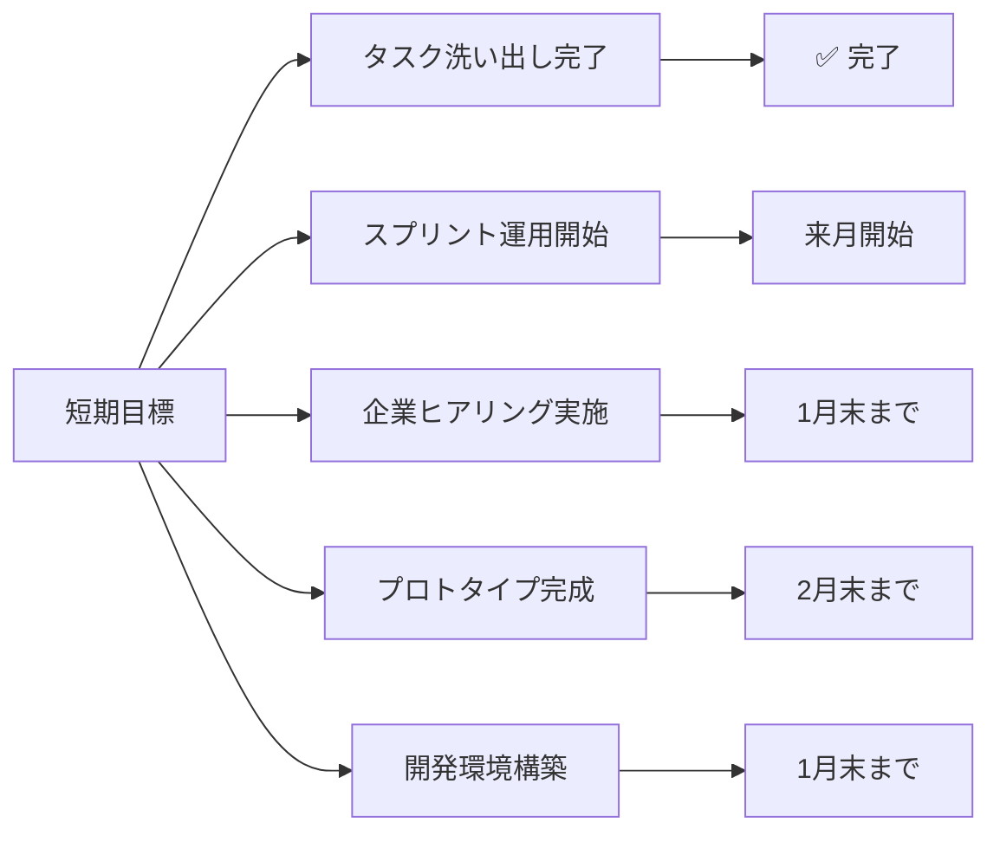

#### 🔥 最優先項目
1. **📋 タスクの全量洗い出し完了** (✅ 完了)
2. **⚙️ スプリント運用方針決定** (来月開始)
3. **🗣️ モニターユーザーへのヒアリング実施** (来週または再来週)
4. **🏢 平野鉄鋼との初回インタビュー実施** (1月末まで)
5. **🏗️ 開発環境構築開始** (1月末まで)
6. **🔄 エピック構造の再検討完了** (来週中)
7. **📊 システムアーキテクチャ関連資料の共有** (劉さん)

### 📈 中期目標（3-6ヶ月）

#### 🎯 主要マイルストーン
1. **🎨 プロトタイプの完成とデモ準備**
2. **🏢 MVP候補企業との詳細ヒアリング**
3. **🤖 AI機能の実装方針確定**
4. **📋 業務テンプレートの具体化**
5. **🏗️ 基盤構築完了** (6週目目標)
6. **⚙️ コア機能開発完了** (12週目目標)

### 🚀 長期目標（6-12ヶ月）

#### 🌟 最終目標
1. **🎉 MVPの本格運用開始**
2. **📈 他企業への展開**
3. **🛍️ マーケットプレイスの構築**

### 📊 成功指標（KPI）

| 指標 | 目標値 | 期限 |
|------|--------|------|
| **企業ヒアリング完了** | 4社 | 3月末 |
| **プロトタイプ完成** | 1つ | 2月末 |
| **基盤構築完了** | 1つ | 6週目 |
| **コア機能開発完了** | 1つ | 12週目 |
| **MVP運用開始** | 1社 | 6月末 |
| **他企業展開** | 3社 | 12月末 |

## 📞 連絡先・問い合わせ

### 👥 プロジェクトチーム
- **プロジェクトマネージャー**: G1st Official
- **技術責任者**: 橘田さん
- **AI開発責任者**: 劉さん
- **営業・企画責任者**: 瀬木さん

### 📧 連絡方法
- **Slack**: #torrent4.0-development
- **Notion**: DB04_議事録
- **定期会議**: 週次開発管理定例会

---

## 📚 参考資料

### 📄 関連ドキュメント
- [ヒアリング記録](./02_課題定義/ヒアリング記録_2025-01-15.md)
- [ペルソナ一覧](./01_ペルソナ作成/ペルソナ一覧.md)
- [開発タスク分解総括](./07_開発タスク分解/開発タスク分解総括.md)
- [工数見積もり](./07_開発タスク分解/工数見積もり.md)
- [開発スケジュール](./07_開発タスク分解/開発スケジュール.md)
- [リスク分析](./07_開発タスク分解/リスク分析.md)
- [README.md](../README.md)

### 🔗 外部リンク
- **Notion議事録**: Smallit社とのMTG議事録（DB04_議事録）
- **最新議事録**: Smallit_torrent_開発管理定例（2025-10-08）

---

**📅 最終更新**: 2025年1月15日  
**👤 記録者**: 開発チーム  
**📊 情報源**: ヒアリング記録 + Notion議事録（2025年10月6日-10日） + 開発タスク分解成果物  
**🔄 次回更新予定**: 進捗に基づき随時更新

---

*🚀 Torrent4.0 - 中小企業のDXを加速させる自動目標管理システム*

