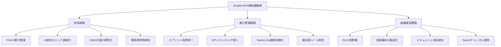

# 🧭 Smallit社「Torrent4.0」MVP開発 アーティファクトサマリー  
（作成：株式会社Giving First／橘田）  
**最終更新：2025年10月23日**

---

## 📋 最新会議内容反映（2025年10月20日-23日）

### 🏢 Smallit社開発管理定例（2025年10月20日）

**主要なアクションアイテム：**
1. **岩野さんに田中さんからの共有状況を確認**（担当: @ito）
2. **必要に応じて田中さんとの調整を実施**（担当: @劉）
3. **テスト結果の発表を明日のタイミングで実施**（担当: @ito）
4. **野平チェックと平野鉄鋼の日程について情報収集**（担当: @t_kitta）
5. **犬田さんが東京でのコーディング作業に着手予定**

**スケジュール調整：**
- 次回定例は23日に予定、13日の可能性もあり
- 野平チェック関連のインタビューミーティングの日程は未定
- 平野鉄鋼の第2回打ち合わせの日程も未確定

### 🏭 平野鉄工さんヒアリング会（2025年10月15日）

**主要な課題と解決策：**
1. **見積もりプロセスの効率化**: 1週間から2-3日への短縮
2. **管理会計システムの導入**: 事業部門別収益性の可視化
3. **作業時間管理システム**: スマートフォン入力システムの導入
4. **営業活動の効率化**: 訪問先アラートシステムの検討
5. **DX化の推進**: 愛知県のDX支援プログラム活用

---

---

## 📊 会議内容から抽出された重要な洞察

### 🎯 技術開発の進捗状況
- **AI機能開発**: パンタレー社との連携が順調に進行中
- **統合基盤**: 犬田さんによる東京でのコーディング作業が開始
- **テスト結果**: 技術検証の結果が発表され、次のステップに進む準備完了

### 🏢 企業ヒアリングの成果
- **平野鉄工さん**: 具体的な課題と解決策が明確化
- **野平チェック**: 新たなヒアリング候補として追加
- **平野鉄鋼**: 第2回打ち合わせの準備が進行中

### 📈 プロジェクト管理の改善点
- **スプリント運用**: 2週間スプリントでの開発管理が本格化
- **チーム体制**: 新規エンジニアの参画と引き継ぎが完了
- **進捗管理**: 定期的な進捗確認と課題解決の仕組みが確立

---

## 1️⃣ プロジェクト概要

| 項目 | 内容 |
|------|------|
| プロジェクト名 | Smallit社 Torrent4.0 MVP開発 |
| 目的 | 製造業向けAI目標管理SaaS「Torrent4.0」のMVP開発とPoC実証 |
| 期間 | 2025年10月〜2026年6月 |
| 管理責任 | 橘田（Giving First代表） |
| 開発責任 | Smallit社開発チーム（PM: 瀬木氏） |
| コミュニケーション | Microsoft Teams |
| ドキュメント保管 | SharePoint（正式資料）／Notion・Googleスライド（報告・要約） |
| 管理ツール | Jira（スクラム運用・エピック管理） |

---

## 2️⃣ MVP開発の目的とゴール

### 🎯 プロダクトゴール
- Torrent4.0 MVPを3社以上の製造業顧客でPoC導入  
- AIによるPDCA支援機能を実装し、**PMF仮説の検証**を行う  
- PoC実証をもとに「製品化・資金調達フェーズ」へ移行可能な状態を構築

### 💼 ビジネスゴール
- 製造業DX市場における市場適合性を明確化  
- PoCレポートをもとに投資・パートナー提案を可能にする  
- 3社以上の実証実績確保

### 👥 チームゴール
- Giving First・Smallit間で共通のMVPロードマップを可視化  
- 2週間スプリントで「成果・学び・KPI」を共有  
- Teams／Jira／SharePointを横断した透明性ある開発体制の確立

---

## 3️⃣ フェーズ構成（ロードマップ）

| フェーズ | 期間 | 成果物 | 管理方法 |
|-----------|------|----------|-----------|
| Phase 1：Discovery | 2025/10〜11 | 顧客課題・仮説定義／MVPスコープ | Notion（課題DB） |
| Phase 2：Design | 2025/12〜2026/1 | UX設計・画面構成・PoC仕様 | Jira（EP-02）＋Figma |
| Phase 3：Build | 2026/2〜5 | α／β版開発・AI統合 | Jiraスプリント管理 |
| Phase 4：Validate | 2026/6 | PoC実証・分析・改善報告 | SharePoint＋Googleスライド |

---

## 4️⃣ 成功指標（KPI / KGI）

| 観点 | 指標 | 目標値 |
|------|------|--------|
| 技術 | 稼働率 | 99%以上 |
| 機能 | AI助言精度 | 80%以上 |
| 体験 | 操作エラー率 | 5%以下 |
| ビジネス | PoC実施社数 | 3社以上 |
| 組織 | スプリント完遂率 | 90%以上 |

---

## 5️⃣ Jiraプロジェクト設計（構造）



### 🔹 プロジェクト設定
- **キー**：SMT  
- **方式**：スクラムボード（2週間スプリント）
- **メンバー構成**
  - 橘田（PM・管理統括）
  - Smallit開発チーム（技術実装）
  - Smallit PM（進行管理・レビュー）

### 🔹 エピック構造
| エピックID | 名称 | 目的 | 成果物 |
|-------------|------|------|--------|
| EP-01 | プロダクトビジョン構築 | 顧客課題整理・MVP定義 | 仮説キャンバス・要件定義書 |
| EP-02 | UX/UI設計 | 体験設計・Figmaモック | 画面設計書 |
| EP-03 | コア機能開発 | AI・DB・PDCAロジック構築 | α〜β版アプリ |
| EP-04 | PoC実証・改善 | 実証運用＋改善報告 | PoC報告書・KPI分析 |

---

## 6️⃣ チケット階層（構造図）

```mermaid
graph TD
    A[EP-01 ビジョン構築]
      --> A1[顧客課題ヒアリング]
      --> A2[MVPスコープ確定]
    A1 --> A11[ヒアリング結果整理]
    A2 --> A21[仮説キャンバス作成]

    B[EP-02 UX/UI設計]
      --> B1[ユーザーフロー設計]
      --> B2[Figmaモックアップ作成]
    B1 --> B11[利用シナリオ定義]
    B2 --> B21[モックアップレビュー]

    C[EP-03 コア機能開発]
      --> C1[AI助言エンジン構築]
      --> C2[DB/API標準化]
      --> C3[Docker環境構築]
    C1 --> C11[パラメータ最適化]
    C2 --> C21[APIテスト]
    C3 --> C31[テンプレート環境構築]

    D[EP-04 PoC実証・改善]
      --> D1[PoC環境構築]
      --> D2[KPI分析・改善提案]
    D1 --> D11[顧客データ投入]
    D2 --> D21[分析レポート作成]