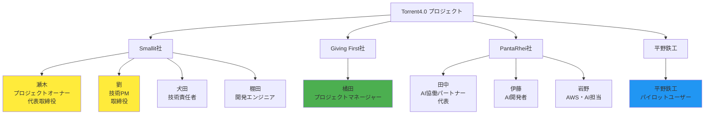
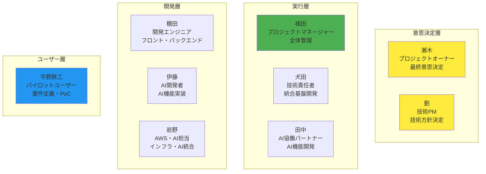

# 📋 Torrent4.0 プロジェクト憲章
**作成日：2025年10月23日**  
**承認日：2025年10月23日**  
**有効期間：2025年10月1日 ～ 2026年6月30日**

---

## 📋 1. プロジェクト概要

### 🎯 プロジェクト基本情報

| 項目 | 内容 |
|------|------|
| **プロジェクト名** | Torrent4.0 MVP開発プロジェクト |
| **プロジェクトコード** | TRT-2025-001 |
| **プロジェクト期間** | 2025年10月1日 ～ 2026年6月30日（9ヶ月） |
| **プロジェクトオーナー** | 瀬木さん（Smallit社代表取締役） |
| **プロジェクトマネージャー** | 橘田さん（株式会社Giving First） |
| **技術責任者** | 劉さん（Smallit社取締役・PM） |

### 🌟 プロジェクトの背景

#### **社会的背景**
- **中小企業のDX化推進**: 2018年以降、国・自治体の後押しにより中小企業のDX化が推進
- **大手企業のDX化必須化**: 大手企業は既にDX取り組みが必須となり、取引先の中小企業にもデジタル対応を求めるケースが増加
- **サプライチェーン全体のDX化**: 受発注システム化など、サプライチェーン全体でのDX化が不可避

#### **業界課題**
- **製造業企業のデータ活用の非効率性**: 企業に転がっているデータを有効活用できていない現状
- **PDCAサイクルの手動管理**: 手動管理による業務効率の低下
- **DX化のコスト・人材不足**: 中小企業の資金・人手・知見不足によりDX化が進まない

#### **プロジェクト発足の経緯**
平野鉄工株式会社とのヒアリング（2025年10月15日実施）を通じて、製造業特有の課題が明確化：
- 見積もり作成に1週間～10日を要する非効率性
- 手書き伝票でのアナログ管理による情報の分散
- 事業別・部署別の収益性把握の困難さ
- 営業担当者1名で60社を担当する業務負荷

---

## 🎯 2. プロジェクトの目的・目標

### 🎯 プロジェクトの目的

**中小企業向けAI目標管理SaaS「Torrent4.0」のMVP開発を通じて、製造業の営業担当者および現場作業員の業務効率を向上させ、データドリブンな経営を実現する。**

### 🌟 成功の定義

**2026年6月頃にMVPを完成させ、平野鉄工さん等でのPoCを行い、夏のシステム系展示会でTorrent4.0を紹介し、本格的な販売に進める状態であること**

### 📊 具体的目標

#### **短期目標（2025年10月-12月）**
1. **基盤構築完了**: 統合基盤（認証・認可、データベース、API基盤）の完成
2. **AI機能開発開始**: パンタレー社との協働によるAI機能開発の本格化
3. **企業ヒアリング完了**: 平野鉄工さん等での詳細ヒアリング実施

#### **中期目標（2026年1月-3月）**
1. **コア機能開発完了**: ダッシュボード、目標設定、進捗管理機能の完成
2. **AI機能統合**: パンタレー社AI機能の統合とテスト
3. **プロトタイプ完成**: 顧客向けデモ用プロトタイプの完成

#### **長期目標（2026年4月-6月）**
1. **MVP完成**: 統合基盤（目標管理システム）のMVP完成
2. **PoC実施**: 平野鉄工さん等でのPoC実施と効果検証
3. **展示会出展**: 夏のシステム系展示会での製品紹介
4. **本格販売準備**: 展示会後の本格的な販売体制構築

---

## 💼 3. ビジネスニーズ

### 🏭 平野鉄工さんの現状課題

#### **製造業特有の業務課題**
- **見積もり作成の非効率性**: 1週間～10日を要する見積もり作成プロセス
- **アナログ管理による情報分散**: 手書き伝票での管理によるデータ活用不足
- **事業別収益性の把握困難**: 車関係、製鉄関係、その他の利益可視化ができない
- **営業活動の非効率性**: 営業担当者1名で60社を担当する業務負荷

#### **競合環境の変化**
- **大手企業のDX化必須化**: 取引先の中小企業にもデジタル対応を要求
- **サプライチェーン全体のDX化**: 受発注システム化の不可避性
- **後出し注文のリスク**: 自動車関係での特殊な取引慣行による利益圧迫

### 🎯 Torrent4.0による解決価値

#### **定量的効果**
| 課題 | 現状 | 目標 | 改善率 |
|------|------|------|--------|
| **見積もり作成時間** | 1週間～10日 | 2-3日 | 70%短縮 |
| **作業時間管理** | 手動入力 | 自動化 | 90%効率化 |
| **経営判断速度** | 月次 | リアルタイム | 即座対応 |
| **営業効率** | 60社管理 | 最適化された訪問計画 | 30%向上 |

#### **定性的効果**
- **データドリブン経営**: 感覚的判断からデータに基づく判断への転換
- **競合優位性**: 迅速な見積もり対応による受注率向上
- **経営透明性**: 事業別・部署別の収益性明確化
- **従業員満足度**: 手作業削減による業務効率化

### 🚀 競合優位性

#### **既存SaaSとの差別化**
| 機能 | キャディ・ズメーン | Torrent4.0 |
|------|-------------------|------------|
| **図面管理** | ○ | ○ |
| **見積もり機能** | ○ | ○ |
| **AI分析** | △ | ○ |
| **統合基盤** | × | ○ |
| **カスタマイズ性** | △ | ○ |
| **コスト効率** | 月額3万円～ | 統合基盤として効率的 |

#### **Torrent4.0の優位性**
- **統合基盤**: 見積もりだけでなく、全業務の統合管理
- **AI分析**: 過去データを活用した高度な分析機能
- **カスタマイズ性**: 製造業特有の業務フローに対応
- **段階的導入**: リスクを抑えた段階的な機能拡張

### 📈 市場機会

#### **中小企業DX化市場**
- **国・自治体の後押し**: 2018年以降の中小企業DX化推進政策
- **大手企業の要求**: 取引先のデジタル対応必須化
- **サプライチェーン全体のDX化**: 受発注システム化の不可避性

#### **製造業特有のニーズ**
- **データ活用の非効率性**: 企業に転がっているデータの有効活用不足
- **PDCAサイクルの手動管理**: 手動管理による業務効率の低下
- **DX化のコスト・人材不足**: 中小企業の資金・人手・知見不足

### 🎯 ビジネス目標

#### **短期目標（2025年10月-12月）**
- **平野鉄工さんでのPoC成功**: 見積もり効率化の実証
- **AI図面解析機能の実装**: 2-3日での見積もり提出を実現
- **データ統合基盤の構築**: 全業務データの一元管理

#### **中期目標（2026年1月-6月）**
- **MVP完成**: 統合基盤（目標管理システム）の完成
- **PoC効果の実証**: 定量的効果の測定と検証
- **展示会出展**: 夏のシステム系展示会での製品紹介

#### **長期目標（2026年7月以降）**
- **本格販売開始**: 持続可能なビジネスモデルの確立
- **他企業への展開**: 製造業向けSaaSとしての市場展開
- **売上拡大**: 平野鉄工の売上拡大（2億円→2.5億円）

---

## 👥 4. ステークホルダー

### 🏢 プロジェクトスポンサー

| 役割 | 氏名 | 所属 | 責任範囲 |
|------|------|------|----------|
| **プロジェクトオーナー** | 瀬木 | Smallit社代表取締役 | 最終意思決定、予算承認、戦略方針決定 |

### 👥 主要ステークホルダー

| 役割 | 氏名 | 所属 | 責任範囲 |
|------|------|------|----------|
| **プロジェクトマネージャー** | 橘田 | 株式会社Giving First | プロジェクト全体管理、進捗管理、課題解決 |
| **技術PM** | 劉 | Smallit社取締役 | 技術方針決定、AI機能開発管理 |
| **AI協働パートナー** | 田中 | PantaRhei社代表 | AI機能開発、技術統合 |
| **パイロットユーザー** | 平野鉄工 | 平野鉄工株式会社 | 要件定義、PoC実施、フィードバック提供 |

### 🔧 開発チーム

| 役割 | 氏名 | 所属 | 責任範囲 |
|------|------|------|----------|
| **技術責任者** | 犬田 | Smallit社 | 統合基盤開発、技術アーキテクチャ設計 |
| **開発エンジニア** | 棚田 | Smallit社 | フロントエンド・バックエンド開発 |
| **AI開発者** | 伊藤 | PantaRhei社 | AI機能開発、データ分析 |
| **AWS・AI担当** | 岩野 | PantaRhei社 | インフラ構築、AI統合 |

### 📊 プロジェクト組織体制図

### 🎯 プロジェクト内役割・責任マトリックス

### 💬 コミュニケーション戦略

#### **🎯 最重要ステークホルダー**
- **瀬木**（プロジェクトオーナー）: 週次ステアリングコミッティ
- **劉**（技術PM）: 日次開発定例会
- **橘田**（プロジェクトマネージャー）: 日次プロジェクト管理
- **平野鉄工**（パイロットユーザー）: 月次進捗レビュー

#### **📈 高優先ステークホルダー**
- **犬田**（技術責任者）: 日次技術進捗
- **田中**（PantaRhei社代表）: 週次AI技術連携
- **伊藤・岩野**（AI開発チーム）: 週次AI機能開発

#### **📋 定期的情報提供**
- **平野鉄工**: 月次進捗レビュー・フィードバック収集
- **PantaRhei社**: 週次AI技術連携・開発進捗共有

### 🚨 緊急時連絡先

| 状況 | 連絡先 | 連絡方法 | 対応時間 |
|------|--------|----------|----------|
| **技術的緊急事態** | 犬田（技術責任者） | Teams + 電話 | 24時間以内 |
| **顧客対応緊急事態** | 瀬木（プロジェクトオーナー） | Teams + 電話 | 営業時間内 |
| **経営判断必要** | 瀬木（プロジェクトオーナー） | Teams + メール | 24時間以内 |
| **プロジェクト管理** | 橘田（プロジェクトマネージャー） | Teams + メール | 営業時間内 |
| **AI技術関連** | 劉（技術PM） | Teams + メール | 営業時間内 |

---

## 📊 5. プロジェクトスコープ

### ✅ 含まれるもの（In Scope）

#### **1. 統合基盤開発**
- 認証・認可システム
- データベース設計・構築
- API基盤構築
- 共通コンポーネント開発

#### **2. コア機能開発**
- ダッシュボード機能
- 目標設定機能
- 進捗管理機能
- システム管理機能

#### **3. 技術要素開発**
- AI機能（PantaRhei社協働）
- BI機能
- データ収集機能
- MDM機能

#### **4. PoC実施**
- 平野鉄工さんでのPoC
- 効果測定・検証
- 改善提案・実装

### ❌ 含まれないもの（Out of Scope）

#### **1. 業務テンプレートの詳細設計**
- 統合基盤完成後の検討事項
- マーケットプレイス機能の詳細設計

#### **2. 他企業への展開**
- MVP完成後の検討事項
- 営業・マーケティング活動

#### **3. 展示会準備**
- MVP完成後の検討事項
- 展示会出展の詳細準備

---

## ⏰ 6. スケジュール・マイルストーン

### 📅 開発スケジュール（26週間）

| フェーズ | 期間 | 主要成果物 | 責任者 |
|-----------|------|------------|--------|
| **Phase 1: 基盤構築** | 2025/10/1-11/15 | 統合基盤完成 | 犬田 |
| **Phase 2: コア機能開発** | 2025/11/16-2026/1/15 | ダッシュボード・目標管理機能 | 開発チーム |
| **Phase 3: 管理機能開発** | 2026/1/16-3/15 | システム管理機能 | 開発チーム |
| **Phase 4: 技術要素・テスト** | 2026/3/16-5/15 | AI機能・BI機能統合 | PantaRhei社 |
| **Phase 5: テスト・リリース準備** | 2026/5/16-6/30 | MVP完成・PoC準備 | 全チーム |

### 📋 PM推進ゴール・マイルストーン

#### **Phase 1: 立ち上げフェーズ（2025/10/1-11/15）**

| カテゴリ | ゴール | 成果物 | 期限 | 責任者 |
|----------|--------|--------|------|--------|
| **プロジェクト管理基盤** | プロジェクト管理体制の確立 | ・コミュニケーションルール策定 ・会議体の運用開始 ・Jira設定完了 | 2025/10/31 | 橘田 |
| **ドキュメント整備** | プロジェクト文書体系の構築 | ・プロジェクト憲章承認 ・ステークホルダーマップ作成 ・リスク管理計画策定 | 2025/11/15 | 橘田 |
| **営業資料作成** | 顧客向け提案資料の準備 | ・平野鉄工向け提案書 ・デモ用プレゼンテーション ・競合分析資料 | 2025/11/15 | 橘田 |
| **ステークホルダー管理** | 関係者との連携強化 | ・定期的なステアリングコミッティ開催 ・進捗報告体制の確立 ・課題エスカレーション手順の確立 | 2025/11/15 | 橘田 |

#### **Phase 2-3: 開発推進フェーズ（2025/11/16-2026/3/15）**

| カテゴリ | ゴール | 成果物 | 期限 | 責任者 |
|----------|--------|--------|------|--------|
| **進捗管理** | 開発進捗の可視化と管理 | ・週次進捗レポート ・KPIダッシュボード ・課題管理システム | 継続 | 橘田 |
| **品質管理** | 品質基準の確立と監視 | ・品質管理計画 ・テスト計画策定 ・品質レビュー体制 | 2026/1/31 | 橘田 |
| **営業活動支援** | 顧客との連携強化 | ・平野鉄工との定期ミーティング ・要件確認・調整 ・フィードバック収集 | 継続 | 橘田 |

#### **Phase 4-5: リリース準備フェーズ（2026/3/16-6/30）**

| カテゴリ | ゴール | 成果物 | 期限 | 責任者 |
|----------|--------|--------|------|--------|
| **PoC準備** | 平野鉄工でのPoC実施準備 | ・PoC実施計画 ・データ移行計画 ・ユーザートレーニング計画 | 2026/5/31 | 橘田 |
| **営業展開準備** | 本格販売に向けた準備 | ・展示会出展資料 ・営業戦略策定 ・価格設定・契約条件 | 2026/6/30 | 橘田 |
| **運用体制構築** | 継続的なサービス提供体制 | ・運用マニュアル ・サポート体制構築 ・継続的改善プロセス | 2026/6/30 | 橘田 |

### 🎯 主要マイルストーン

#### **技術開発マイルストーン**

| マイルストーン | 期限 | 成果物 | 成功基準 |
|----------------|------|--------|----------|
| **基盤構築完了** | 2025年12月 | 統合基盤の基本機能 | 認証・認可、DB、API基盤完成 |
| **コア機能完了** | 2026年3月 | ダッシュボード・目標管理 | 主要機能の動作確認完了 |
| **管理機能完了** | 2026年6月 | システム管理機能 | ユーザー管理・権限管理完成 |
| **技術要素完了** | 2026年9月 | AI機能・BI機能 | AI統合・データ分析機能完成 |
| **MVP完成・PoC開始** | 2026年12月 | 完成版MVP・PoC環境 | 平野鉄工でのPoC開始 |

#### **PM推進マイルストーン**

| マイルストーン | 期限 | 成果物 | 成功基準 |
|----------------|------|--------|----------|
| **プロジェクト管理基盤確立** | 2025年10月31日 | 管理体制・ルール整備 | コミュニケーションルール運用開始 |
| **ドキュメント体系構築** | 2025年11月15日 | プロジェクト文書完成 | プロジェクト憲章承認・ステークホルダーマップ完成 |
| **営業資料完成** | 2025年11月15日 | 顧客向け提案資料 | 平野鉄工向け提案書・デモ資料完成 |
| **品質管理体制確立** | 2026年1月31日 | 品質管理計画 | テスト計画・品質レビュー体制確立 |
| **PoC実施準備完了** | 2026年5月31日 | PoC実施計画 | 平野鉄工でのPoC準備完了 |
| **営業展開準備完了** | 2026年6月30日 | 営業戦略・資料 | 展示会出展・本格販売準備完了 |

---

## 💰 7. 予算・リソース

### 👥 開発工数

| 項目 | 工数 | 期間 | チーム体制 |
|------|------|------|------------|
| **総工数** | 454人日 | 26週間 | 9名 |
| **基盤開発タスク** | 70日 | Phase 1 | 犬田中心 |
| **機能別開発タスク** | 150日 | Phase 2-3 | 開発チーム |
| **画面別開発タスク** | 72日 | Phase 2-3 | フロントエンドチーム |
| **技術要素別開発タスク** | 72日 | Phase 4 | PantaRhei社 |
| **共通機能開発タスク** | 30日 | 全期間 | 全チーム |
| **テスト・品質保証タスク** | 30日 | Phase 5 | 全チーム |
| **デプロイ・運用タスク** | 30日 | Phase 5 | 全チーム |

### 💼 リソース配分

| チーム | メンバー数 | 工数配分 | 主要責任 |
|--------|------------|----------|----------|
| **Smallit開発チーム** | 4名 | 200人日 | 統合基盤、コア機能開発 |
| **PantaRhei社** | 3名 | 150人日 | AI機能、データ分析 |
| **Giving First** | 1名 | 50人日 | プロジェクト管理 |
| **外部協力** | 1名 | 54人日 | 専門技術支援 |

---

## 🎯 8. 成功指標（KPI）

### 📊 開発KPI

| 指標 | 目標値 | 測定方法 | 責任者 |
|------|--------|----------|--------|
| **MVP完成** | 2026年6月まで | マイルストーン達成状況 | 橘田 |
| **PoC実施** | 平野鉄工でのPoC成功 | PoC結果レポート | 橘田 |
| **品質基準** | レスポンス時間3秒以内、可用性99.9%以上 | 性能テスト結果 | 犬田 |
| **スケジュール遵守率** | 90%以上 | マイルストーン達成率 | 橘田 |

### 💼 ビジネスKPI

| 指標 | 目標値 | 測定方法 | 責任者 |
|------|--------|----------|--------|
| **展示会出展** | 夏のシステム系展示会での製品紹介 | 展示会出展実績 | 瀬木 |
| **本格販売準備** | 展示会後の販売体制構築完了 | 販売体制構築状況 | 瀬木 |
| **顧客満足度** | PoC実施企業の満足度80%以上 | 顧客フィードバック | 橘田 |

### 🏢 平野鉄工さんへの効果指標

| 指標 | 現状 | 目標 | 改善率 |
|------|------|------|--------|
| **見積もり作成時間** | 1週間～10日 | 2-3日 | 70%短縮 |
| **作業時間管理** | 手動入力 | 自動化 | 90%効率化 |
| **経営判断速度** | 月次 | リアルタイム | 即座対応 |
| **営業効率** | 60社管理 | 最適化された訪問計画 | 30%向上 |

---

## ⚠️ 9. 主要リスクと対策

### 🔧 技術リスク

| リスク | 影響度 | 発生確率 | 対策 | 責任者 |
|--------|--------|----------|------|--------|
| **AI技術の実装リスク** | 高 | 中 | 早期技術調査・プロトタイプ作成 | 劉 |
| **BI技術の統合リスク** | 中 | 中 | 技術調査・統合テスト | 伊藤 |
| **外部システム連携リスク** | 中 | 高 | 早期統合テスト・代替案準備 | 犬田 |

### 📅 スケジュールリスク

| リスク | 影響度 | 発生確率 | 対策 | 責任者 |
|--------|--------|----------|------|--------|
| **工数見積もりの不確実性** | 高 | 中 | バッファ確保・段階的実装 | 橘田 |
| **依存関係の複雑さ** | 中 | 高 | 依存関係整理・並行開発 | 橘田 |
| **チームメンバーの変更** | 中 | 低 | 知識共有・ドキュメント化 | 橘田 |

### 💰 品質リスク

| リスク | 影響度 | 発生確率 | 対策 | 責任者 |
|--------|--------|----------|------|--------|
| **パフォーマンス要件の実現リスク** | 高 | 中 | 早期パフォーマンステスト | 犬田 |
| **セキュリティ要件の実現リスク** | 高 | 低 | セキュリティ設計・テスト | 犬田 |
| **ユーザビリティの課題** | 中 | 中 | ユーザーテスト・改善 | 橘田 |

---

## 📋 10. 意思決定プロセス

### 🏢 ステアリングコミッティ

| 項目 | 内容 |
|------|------|
| **開催頻度** | 週次（毎週木曜日 14:00-15:00） |
| **参加者** | 瀬木、橘田、劉 |
| **意思決定者** | 瀬木（プロジェクトオーナー） |
| **上申プロセス** | ステアリングコミッティでの瀬木への上申 |

### 🔧 開発管理

| 会議 | 頻度 | 参加者 | 目的 |
|------|------|--------|------|
| **日次開発定例会** | 毎日9:00-9:30 | 開発チーム全員 | 進捗確認・作業計画共有 |
| **AI構想ミーティング** | 不定期 | AI開発チーム | 技術検討・設計方針決定 |

### 📊 意思決定権限

| 決定事項 | 決定者 | 承認者 | 実行者 |
|----------|--------|--------|--------|
| **プロジェクト方針変更** | 瀬木 | 瀬木 | 橘田 |
| **スケジュール変更** | 瀬木 | 瀬木 | 橘田 |
| **技術方針変更** | 劉 | 瀬木 | 劉 |
| **予算・工数見直し** | 瀬木 | 瀬木 | 橘田 |

---

## 📈 11. 期待される成果

### 🏢 平野鉄工さんへの効果

| 効果 | 現状 | 目標 | 期待値 |
|------|------|------|--------|
| **見積もり作成時間短縮** | 1週間～10日 | 2-3日 | 70%短縮 |
| **作業時間管理自動化** | 手動入力 | 自動化 | 90%効率化 |
| **経営判断速度向上** | 月次 | リアルタイム | 即座対応 |
| **営業効率向上** | 60社管理 | 最適化された訪問計画 | 30%向上 |

### 💼 ビジネス成果

| 成果 | 内容 | 期待値 |
|------|------|--------|
| **MVP完成** | 中小企業向け自動目標管理SaaSの完成 | 2026年6月 |
| **PoC成功** | 実証された効果による製品価値の証明 | 平野鉄工さんでの成功 |
| **展示会出展** | 市場への製品紹介と認知度向上 | 夏のシステム系展示会 |
| **本格販売** | 持続可能なビジネスモデルの確立 | 展示会後の販売体制構築 |

### 🌟 社会的インパクト

| インパクト | 内容 | 期待値 |
|------------|------|--------|
| **中小企業DX化促進** | 製造業のデジタル化支援 | 業界全体の効率化 |
| **データドリブン経営実現** | AI活用による経営判断支援 | 競争力向上 |
| **働き方改革支援** | 業務効率化による働き方改善 | 労働環境向上 |

---

## 📝 12. 承認・承認者

### 📋 承認情報

| 項目 | 内容 |
|------|------|
| **プロジェクト憲章承認者** | 瀬木さん（Smallit社代表取締役） |
| **承認日** | 2025年10月23日 |
| **有効期間** | 2025年10月1日 ～ 2026年6月30日 |
| **次回見直し予定** | 2025年12月（基盤構築完了時） |

### 📞 連絡先・問い合わせ

| 役割 | 氏名 | 所属 | 連絡先 |
|------|------|------|--------|
| **プロジェクトオーナー** | 瀬木 | Smallit社代表取締役 | [連絡先] |
| **プロジェクトマネージャー** | 橘田 | 株式会社Giving First | [連絡先] |
| **技術責任者** | 劉 | Smallit社取締役 | [連絡先] |

---

## 📚 13. 参考資料

### 📄 関連ドキュメント

- [プロジェクト全体像](./プロジェクト全体像_2025-01-15.md)
- [ミーティング資料](./ミーティング資料_2025-10-23.md)
- [コミュニケーションルール](./コミュニケーションルール_2025-10-23.md)
- [プロジェクト報告書](./プロジェクト報告書20251023.md)

### 🔗 外部リンク

- **Notion議事録**: Smallit社とのMTG議事録（DB04_議事録）
- **Microsoft Teams**: Torrent4.0開発チーム
- **SharePoint**: 正式文書保管場所

---

**📅 最終更新**: 2025年10月23日  
**👤 作成者**: 橘田（株式会社Giving First）  
**📊 情報源**: プロジェクト全体像 + ミーティング資料 + コミュニケーションルール  
**🔄 次回更新予定**: 2025年12月（基盤構築完了時）

---

*🚀 Torrent4.0 - 中小企業のDXを加速させる自動目標管理システム*
