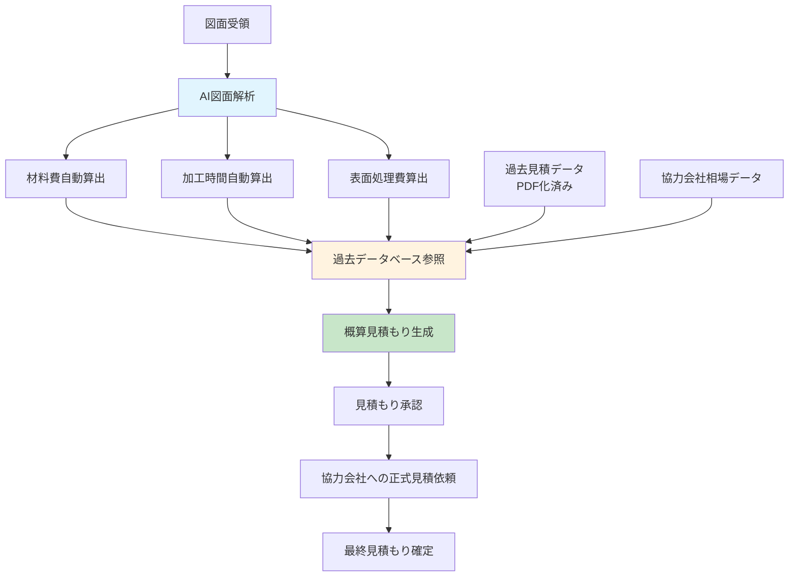
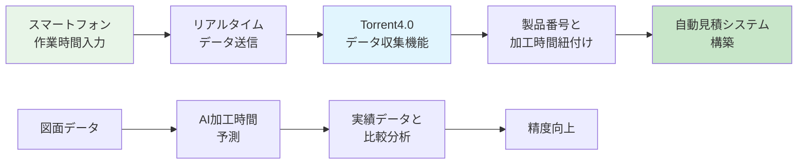
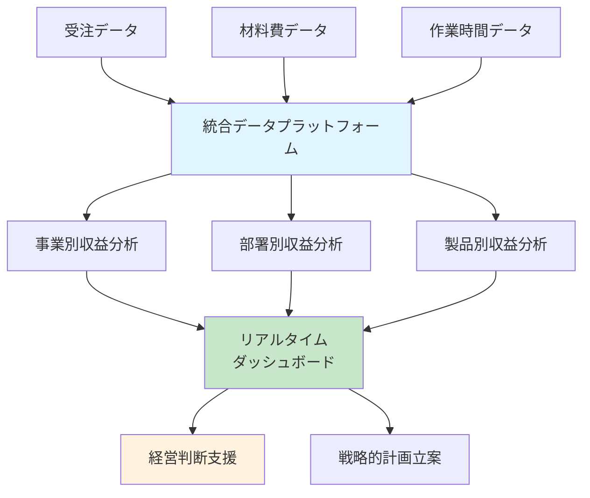
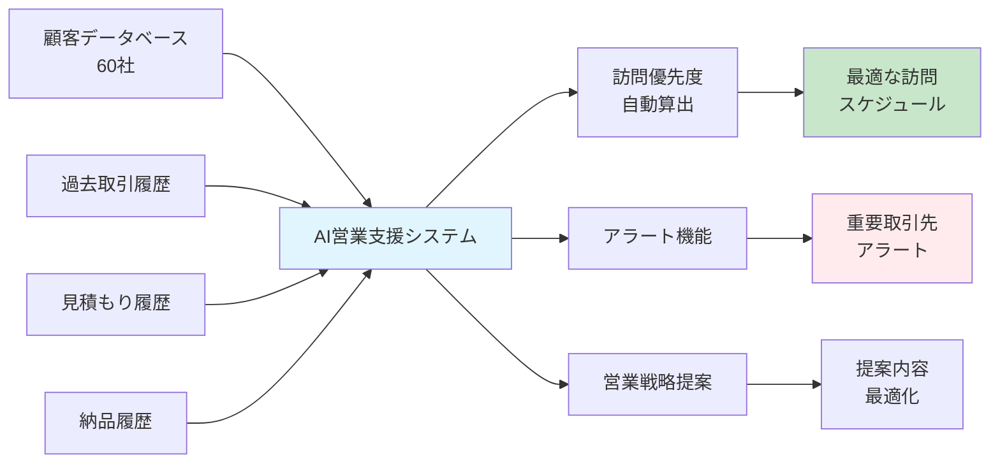
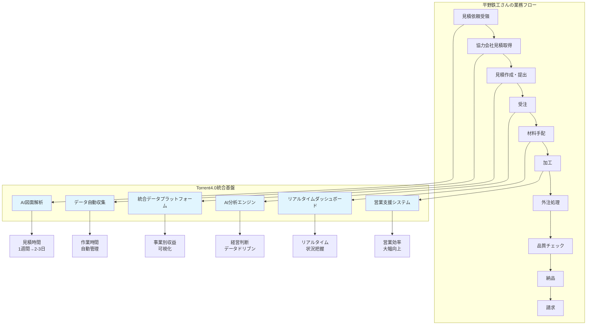
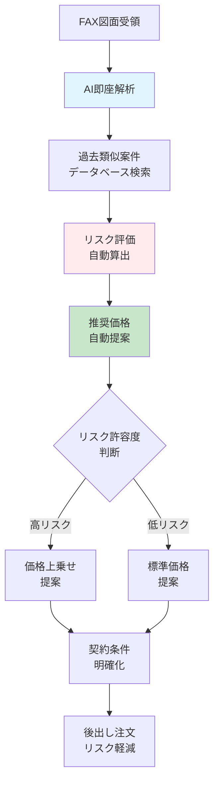

# Torrent4.0による平野鉄工さんの課題解決ソリューション

## 概要
平野鉄工さんが抱える製造業特有の課題を、Torrent4.0の統合基盤機能とAI分析機能を活用して解決するソリューションを提案します。

## 平野鉄工さんの主要課題と解決策

### 1. 見積もり作成の効率化（1週間→2-3日）

**課題：**
- 見積もり作成に1週間～10日を要する
- 協力会社（材料2社、表面処理2-3社等）からの回答待ち時間が長い
- FAX中心の連絡手段

**Torrent4.0による解決策：**

**実現機能：**
- **AI図面解析機能**: 図面から材料費、加工時間、表面処理費を自動算出
- **過去データ活用**: 7年間蓄積されたPDFデータをAI分析
- **相場データベース**: 協力会社の相場データを蓄積・活用
- **概算見積もり自動生成**: 2-3日での見積提出を実現

### 2. 作業時間管理システムの導入

**課題：**
- 手書き伝票でのアナログ管理
- 作業時間の正確な把握が困難
- 製品番号と加工時間の紐付けができていない

**Torrent4.0による解決策：**

**実現機能：**
- **スマートフォン入力システム**: 現場での作業時間入力
- **自動データ収集**: リアルタイムでのデータ統合
- **AI加工時間予測**: 図面から加工時間を自動算出
- **実績データ分析**: 予測精度の継続的向上

### 3. 管理会計システムの導入

**課題：**
- 全て手書き伝票でアナログ管理
- 事業別（車関係、製鉄関係、その他）の利益把握が困難
- 各部署の収益性を可視化できない

**Torrent4.0による解決策：**

**実現機能：**
- **統合データプラットフォーム**: 全業務データの一元管理
- **事業別収益分析**: 車関係、製鉄関係、その他の利益可視化
- **リアルタイムダッシュボード**: 経営状況の即座把握
- **AI分析エンジン**: 収益性の自動分析とインサイト提供

### 4. 営業活動の効率化

**課題：**
- 営業担当者1名で約60社の顧客を担当
- 訪問スケジュール管理が困難
- 取引先の状況把握が不十分

**Torrent4.0による解決策：**

**実現機能：**
- **AI営業支援システム**: 顧客分析と訪問優先度算出
- **アラート機能**: 重要取引先の状況変化を即座通知
- **営業戦略提案**: 過去データに基づく提案内容最適化
- **訪問スケジュール最適化**: 効率的な営業活動の実現

## 統合ソリューション全体像

## 期待される効果

### 定量的効果
- **見積もり作成時間**: 1週間～10日 → 2-3日（70%短縮）
- **作業時間管理**: 手動入力 → 自動化（90%効率化）
- **経営判断速度**: 月次 → リアルタイム（即座対応）
- **営業効率**: 60社管理 → 最適化された訪問計画（30%向上）

### 定性的効果
- **データドリブン経営**: 感覚的判断からデータに基づく判断へ
- **競合優位性**: 迅速な見積もり対応による受注率向上
- **経営透明性**: 事業別・部署別の収益性明確化
- **従業員満足度**: 手作業削減による業務効率化

## 導入ステップ

### フェーズ1（3ヶ月）: 基盤構築
1. **データ統合基盤の構築**
2. **過去データのデジタル化・分析**
3. **AI図面解析システムの導入**

### フェーズ2（6ヶ月）: 業務効率化
1. **見積もり自動化システムの本格運用**
2. **作業時間管理システムの導入**
3. **管理会計システムの構築**

### フェーズ3（12ヶ月）: 高度化
1. **AI分析エンジンの本格運用**
2. **営業支援システムの導入**
3. **予測分析機能の活用**

## 技術的実現方法

### 使用するTorrent4.0機能
- **統合データプラットフォーム**: 全業務データの一元管理
- **AI分析エンジン**: 図面解析、予測分析
- **リアルタイムダッシュボード**: 経営状況の可視化
- **データ自動収集機能**: 外部システムとの連携
- **ワークフロー管理機能**: 業務プロセスの自動化

### 外部システム連携
- **CADシステム**: 図面データの自動取得
- **生産管理システム**: 作業時間データの連携
- **会計システム**: 財務データの統合
- **営業管理システム**: 顧客データの連携

## 平野鉄工さんの特殊課題への対応

### 自動車関係の特殊パターン対応
**課題：**
- 図面をFAXで受領 → 短納期（明後日など）で納品 → 納品後に注文書・価格受領
- 納品後、クライアントから30%値引き要求
- 利益が圧迫され、経常利益がほぼゼロの状態

**Torrent4.0による対応策：**

**実現機能：**
- **即座図面解析**: FAX受領から数分での概算見積もり
- **リスク評価システム**: 過去データに基づくリスク自動算出
- **価格最適化**: 後出し注文リスクを考慮した価格設定
- **契約条件管理**: 明確な契約条件でのリスク軽減

## 競合他社との差別化

### 既存SaaSとの比較
| 機能 | キャディ・ズメーン | Torrent4.0 |
|------|-------------------|------------|
| 図面管理 | ○ | ○ |
| 見積もり機能 | ○ | ○ |
| AI分析 | △ | ○ |
| 統合基盤 | × | ○ |
| カスタマイズ性 | △ | ○ |
| コスト | 月額3万円～ | 統合基盤として効率的 |

**Torrent4.0の優位性：**
- **統合基盤**: 見積もりだけでなく、全業務の統合管理
- **AI分析**: 過去データを活用した高度な分析機能
- **カスタマイズ性**: 製造業特有の業務フローに対応
- **段階的導入**: リスクを抑えた段階的な機能拡張

## 投資対効果（ROI）

### 投資額（年間）
- **システム導入費**: 500万円
- **運用費**: 200万円/年
- **合計**: 700万円/年

### 効果（年間）
- **見積もり効率化**: 200万円/年
- **作業時間削減**: 300万円/年
- **営業効率向上**: 400万円/年
- **管理業務効率化**: 100万円/年
- **合計**: 1,000万円/年

### ROI
- **純利益**: 300万円/年
- **ROI**: 43%
- **回収期間**: 約2.3年

## リスクと対策

### 技術的リスク
- **AI精度**: 段階的な学習データ蓄積で精度向上
- **システム連携**: 既存システムとの段階的連携
- **データ移行**: バックアップ体制の構築

### 運用リスク
- **従業員の抵抗**: 段階的導入と教育プログラム
- **業務中断**: 並行運用期間の設定
- **データ品質**: データクレンジング機能の実装

## まとめ

Torrent4.0の統合基盤機能を活用することで、平野鉄工さんは以下の変革を実現できます：

1. **見積もり業務の劇的効率化**: 1週間から2-3日への短縮
2. **データドリブン経営**: リアルタイムでの経営状況把握
3. **競合優位性の確保**: 迅速な対応による受注率向上
4. **持続的成長**: 効率化による売上拡大（2億円→2.5億円）

このソリューションにより、平野鉄工さんは製造業のDX化を成功させ、競合他社との差別化を図りながら持続的な成長を実現できます。

---

**作成日**: 2025年1月15日  
**対象**: 平野鉄工株式会社  
**提案者**: Torrent4.0開発チーム

